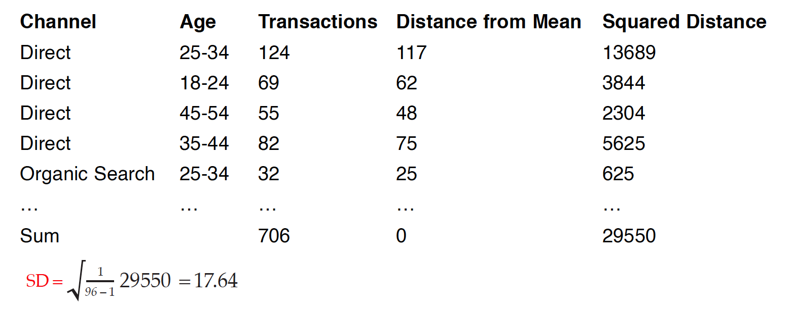

# Statistical Analyses of a Single Variable

This chapter uses data from Google Analytics’ channels report, which demonstrates how much of traffic is coming from specific paid versus unpaid channels to illustrate how to analyze a single variable.

Let's import the Google Analytics’ channels report into RStudio.

```{r}

#You will need to install readxl package

library(readxl) 

my_data <- read_excel("google analytics sample data.xlsx") #Create a dataset and name it as my_data

```

Table 3.1 presents parts of a public demo data set of channels report from Google Analytics of Google Merchandise Store, which is an affiliate of the holding company, Google, and an e-commerce business site that deals with marketing and selling of Google, YouTube, and Android branded merchandise such as stationaries, bags among other products. 


```{r}
#You will need to install kableExtra package
library(kableExtra)

knitr::kable(head(my_data[,1:12], 20), digits = 5, booktabs = TRUE,
  caption = 'The First 20 Rows of the Google Analytics Sample Data'
) %>%
  kable_styling(font_size = 6.5)
```

See the bibliography at the end of the chapter for referral to the complete dataset that you can access and work with. 

## Variables & Levels of Measurement 

In a dataset, the columns identify the variables that represent certain qualities of individuals. Any quality that can vary can be considered a variable. Variables can take on different values or attributes. An attribute is a specific value on a variable. For example, gender might be a variable that we are interested in, and the attributes of gender could be male, female, transgender, and non-binary. 

We use levels of measurement to describe how precisely variables are recorded. There are four levels of measurement: nominal, ordinal, interval, and ratio representing the transition from analyzing qualitative to quantitative data. 

### Nominal Data  

Nominal data is used to label variables. Gender, nationality, race, and ethnicity are a few of the most common examples of nominal data. It can only be categorized based on qualitative differences and there are no orderings or directions among different categories. We only know that males and females have qualitative differences in terms of gender, but we cannot tell how much they differ, nor could we sort individuals based on their gender. We can still assign numbers to different attributes of nominal variables (e.g., we can assign 1 to females and 2 to males, or vice versa), but the numbers only serve as labels that lack numerical values.

For the dataset of Google Analytics from Google Merchandise Store (Table 1), the variable **Channel** is measured at the nominal level, and it indicates the channel through which traffic got to Google Merchandise Store. *Organic Search* indicates visits from unpaid search results. *Direct* indicates visits where users navigated directly to the URL, or the source of the visit is unknown. *Referral* indicates traffic where users clicked a link from another site, excluding major search engines. *Display* indicates traffic from display advertising, such as Google AdWords remarketing campaigns. *Social* indicates visits from social networks (Facebook, Twitter, etc.). *Paid Search* indicates traffic from the PPC (Pay Per Click) campaigns run in search results. 

Since each variable should be exhaustive to include all the possibilities, for the variable of Channel, the attribute “*Other*” is assigned referring to traffic from an un-identified channel. All these different channels through which a user reaches our website are different attributes our channel variable can have. 

### Ordinal Data

Ordinal data also can be categorized, but there are rankings or orderings or scaling between categories. The ordinal measurement has been widely used to analyze variables such as education level (e.g., “high school,” “BS,” “MS,” “Ph.D.”), income level (e.g., “less than 50K,” “50-100K,” “over 100K”), and socioeconomic status (e.g., “lower class,” “middle class,” and “upper class”). 

For the dataset of Google Analytics from Google Merchandise Store (Table 2.1), the variable **Age** is also ordinal, and it refers to the age group of the users. For such ordinal variable, we can turn it into quantitative by assigning numerical values to different categories. 

For example, Age can be defined as having six attributes:1 = 18-24; 2 = 25-34; 3 = 35-44; 4 = 45-54; 5 = 55-64; 6 = 65+. There is a logical ordering among the different age groups, in a way that whoever answers “6” is older than individuals who answer “5” to this question. However, we cannot precisely tell the differences between the two groups because each attribute covers a wide range, and the ranges of different attributes are of different sizes.

### Interval Data 

Interval data refers not only to the classification and ordering of data but also specifies that the distances between every two adjacent attributes on a scale are equal. For interval data, the difference between two values is meaningful, but there is no true zero point or fixed beginning, which refers to a scale where 0 indicates the absence of something. 

The most popular example is the temperature in degrees Fahrenheit or Celsius. The difference between 90 degrees F and 80 degrees F is the same difference between 70 degrees F and 60 degrees F; however, when it comes to 0 degrees F, we cannot say that temperature no longer exists. For interval measures, the value 0 does not mean the absence of this variable; rather, it is just an arbitrary setting that we have agreed upon. 

Another example of interval data is year. For year, 0 does not represent the missing value but indicates the year when Christ was born, and the time before 0 is given the prefix BC. If you were born in the year of 2005 and I was born in the year of 2000, we know that I will be five years older than you. 

For the dataset of Google Analytics from Google Merchandise Store (Table 2.1), the only interval variable is **Year**, indicating the year of each observation. 

### Ratio Data

For ratio data, the difference between two values is also meaningful, and it has a true zero, indicating the absence of such variable. Media consumption is a great example of ratio data. Media consumption can be measured in days, hours, or minutes a person exposes him/herself to media content. If a person has zero media consumption, that means this person does not consume media at all; in other words, to this person, media consumption is absent. 

For ratio data, zero is the starting point, and the distance between two adjacent values is the same. In addition, it makes sense to calculate the ratio of different values: If you have six hours of media consumption and I only have three hours, then we can say that you consume twice as much media as I do. 

Table 2.1 has six ratio variables. **Sessions** are the total number of sessions within the date range. A session is the period time a user is actively engaged with the website of Google Merchandise Store. **Users** are the number of users who have initiated at least one session during the date range, with the value of zero representing no such user exists. **New Users** are the number of first-time users during the selected date range. **Transactions** are the number of completed purchases on Google Merchandise Store. **Ecommerce Conversion Rate** refers to the E-commerce conversion rate that is the percentage of sessions that resulted in an e-commerce transaction. **Revenue** refers to the revenue of the completed purchases. If the revenue from the display channel is 0, that just means there is no income produced by the display Ads. 

What you can do to analyze your data may be limited due to the level of measurement of the variable. The complexity and precision of the level of measurement increase from nominal to ratio. For the ratio level of measurement, we can not only add numbers or subtract numbers but calculate the ratio of two numbers. For example, if the revenue from the organic search channel is 8k and from the paid search is 4k, then the revenue generated from organic search is twice as much as the revenue from paid search.

The rows in a spreadsheet are closely associated with the unit of analysis, which is one of the most important ideas in a research project and the major entity that you are analyzing in your study. You will need to determine the unit of analysis since it determines the analysis you do for your research. 

For instance, if you are comparing the e-commerce performances (e.g., User, Sessions, Transactions, Revenues, ECR) of different channels, the unit of analysis is each individual channel. If you are comparing the e-commerce performance of different age groups, the unit of analysis is each age group. If you are comparing the e-commerce performance of different channels and age groups, the unit of analysis is each individual channel at each age group.

After defining your research questions and the related unit(s) of analysis, and levels of measurement, we may start the data analysis journey by conducting a statistical analysis of a single variable. 

## Frequency Distribution 

The easiest thing we can do is to count the number of times an event or a value occurs for the variable(s) of our choice, and this is called Frequency analysis. We can aggregate individual observations of a variable into groups so that a frequency distribution of these groups can serve as a convenient means of summarizing or describing our data. 

We are going to use the **tidyverse** package to count the aggregated transactions by channel and age groups.

```{r}
#Frequency and grouped frequency analysis
#You will need to install dplyr package
library(tidyverse)

Transaction_Frequency_Channel <- my_data %>% 
  group_by(Channel) %>% 
  summarise(Frequency = sum(Transactions))

Transaction_Frequency_Age <- my_data %>% 
  group_by(Age) %>% 
  summarise(Frequency = sum(Transactions))
```

Table 3.2 demonstrated the grouped frequency of transactions for each channel and age group. From the frequency analysis, we can tell that the direct channel (n = 11581) and the age group of 25 to 34 (n = 4654) had the greatest number of transactions in Google Merchandise Store. 

```{r}

knitr::kable(
  list(
    head(arrange(Transaction_Frequency_Channel, desc(Frequency))), 
    head(arrange(Transaction_Frequency_Age, desc(Frequency)))), 
  booktabs = TRUE,
  caption = 'Grouped Transaction Frequency for Channel and Age'
) %>%
  kable_styling(font_size = 14)
```

## Percentage Change

Here, we can also use the grouped frequency analysis to compare the revenue from each channel between 2020 and 2021 to assess the dynamic changes of each channel. 

```{r} 

#Creat a subset for year 2020 and year 2021

my_data_2020 <- my_data %>% filter(Year == 2020)
my_data_2021 <- my_data %>% filter(Year == 2021)

Revenue_Frequency_2020 <- my_data_2020 %>% 
  group_by(Channel) %>% 
  summarise(Revenue = sum(Revenue))

Revenue_Frequency_2021 <- my_data_2021 %>% 
  group_by(Channel) %>% 
  summarise(Revenue = sum(Revenue))

```

As illustrated in Table 3.3, the direct channel created the most revenues in both 2020 and 2021. When you have such data for two points in time, you can calculate how much change there has been over this period. The result is expressed as a percentage in absolute numbers and is called the percentage change or the rate of change. Here is the formula: **Percentage Change = [(Number at later time / Number at earlier time) - 1] × 100%**. 

```{r}

knitr::kable(
  list(
    head(arrange(Revenue_Frequency_2020, desc(Revenue))), 
    head(arrange(Revenue_Frequency_2021, desc(Revenue)))), 
  booktabs = TRUE,
  caption = 'Grouped Revenue in 2020 and 2021'
) %>%
  kable_styling(font_size = 14)
```

For example, from Table 3.3, in 2020, the revenue generated from the paid search channel was $1975.93. And in 2020, the revenue generated from the paid search channel was 29908.18. The percentage change of revenue from the paid search channel from 2020 to 2021 is then calculated as follows: **[(29908.18/ 1975.93)-1] x 100%= 1413.62%**, meaning that from the year of 2020 to the year of 2021, the revenue generated from the paid search channel increased by 1413.62%. 

## Relative Frequency

For the frequency analysis, we also can count how often something happens divided by all outcomes, which is called the relative frequency analysis. For example, from Table 3.3, the revenue from the organic search channel in 2020 is $4,628.44, and the total revenue in 2020 is the sum of revenue from all channels, which is $34422.26.The relative revenue from the organic search channel is 4,628.44/34422.26 = 13.44%, indicating 13.44% of the revenue in 2020 was from the organic search channel. We can use the codes below to get the relative revenue for each channel in 2020 and 2021 (Table 3.4).

```{r}
Revenue_Relative_Frequency_2020 <- my_data_2020 %>% 
  group_by(Channel) %>% 
  summarise('Revenue_Percentage' = sum(Revenue)/sum(my_data_2020$Revenue))

Revenue_Relative_Frequency_2021 <- my_data_2021 %>% 
  group_by(Channel) %>% 
  summarise('Revenue_Percentage' = sum(Revenue)/sum(my_data_2021$Revenue))

```

```{r}

knitr::kable(
  list(
    head(arrange(Revenue_Relative_Frequency_2020, desc(Revenue_Percentage))), 
    head(arrange(Revenue_Relative_Frequency_2021, desc(Revenue_Percentage)))), 
  booktabs = TRUE,
  caption = 'Grouped Revenue in 2020 and 2021'
) %>%
  kable_styling(font_size = 14)
```

## Percentage Points
We can use the term “percentage points” to compare two different percentages at two points in time. The best way to explain this is through an example: from Table 3.4, in 2020, the share of revenue from the Paid Search channel was 5.74%. In 2021, the share of revenue from the Paid Search channel was 3.12%. The difference of these two percentages is calculated in percentage points: 3.12 % - 5.74 % = -2.62%. This means that the share of revenue from Paid Search channel in 2021 was almost three percentage points lower than the share of revenue from the Paid Search channel in 2020.

## Rate

In data analysis, some variables, such as the ECR (e-commerce conversion rate from Table 2.1), are too small to visualize. Under such circumstances, we can represent the percentage as rate by converting the small proportions to a whole number with one, two, or three digits on a base of some multiple of 1,000, 10,000, 100,000, or 1 million. 

For example, from Table 3.1, in 2020, the Ecommerce Conversion Rate of the organic search channel for users of 25 to 34 is 0.00068 or 0.068%. Instead of reporting the percentage, we can move the decimal place farther to the right, sufficient to make a number greater than 1, which allows us to better visualize the data. In the case of Ecommerce Conversion Rate, moving the decimal point four places to the right is the same as multiplying the value by 10,000. Consequently, the Ecommerce Conversion Rate of the organic search channel was 6.8 per 10,000 sessions. 

We can use the r code below to add a column representing the Ecommerce Conversion Rate per 10,000 sessions for my_data.

```{r}
my_data$ECR <- my_data$`Ecommerce Conversion Rate`*10000
```

Now, the new column has been added to my_data as illustrated in Table 3.5.


```{r}

knitr::kable(head(my_data[,1:13], 20), digits = 5, booktabs = TRUE,
  caption = 'The First 20 Rows of the Google Analytics Sample Data'
) %>%
  kable_styling(font_size = 6.5)
```

## Ratio

Ratio compares the size of two numbers indicating how many times one number contains another. For example, let's calculate the ratio of returning users and new users using the formula: **Number of Old Users / Number of New Users**. We first use the r code below to create a new column **old user (users - new users)**, then we use the **group_by** function to calculate the ratio fo returning users and new users for each channel. 

```{r}
#creating a new colunme of old users
my_data$OldUsers <- my_data$Users-my_data$'New Users'

userratio <- my_data %>% 
  group_by(Channel) %>% 
  summarise(OldUsers = sum(OldUsers), NewUsers = sum(`New Users`),Ratio = sum(OldUsers)/sum(`New Users`))
```

From Table 3.6, we can find that besides the un-defined channel, the referral channel has a relatively higher ratio of returning (old) users to new users, indicating a better retention rate.

```{r}

knitr::kable(
    head(arrange(userratio, desc(Ratio))), 
  booktabs = TRUE,
  caption = 'The Ratio of Old Users and New Users for Each Channel'
) %>%
  kable_styling(font_size = 14)
```
## Central Tendency

Besides using frequency analysis to summarize the distribution of a variable, we also can use the central tendency analysis to understand which attribute of a variable is most typical or representative of the variable distribution. Specifically, the central tendency analysis describes what the center of the data for a variable is. What do we mean by the center of the data? For many, the mean, median, and mode. Mean is the sum of all data points divided by the total number of observations. Median is the midpoint in data with an equal number of data points above and below. If the number of data points is even, then Median is the mean of the two midpoints. Mode is the data point that is most prevalent in the data set. It represents the most likely outcome in a data set. 

Let’s first create a small dataset of test scores from 20 students.

```{r}
StudentID <- c(1:20)
Score <- c(40,50,50,60,60,60,60,60,70,70,70,80,80,80,80,90,90,90,90,100)
TestData <- data.frame(StudentID, Score)
ScoreFrequency <- as.data.frame(table(TestData$Score)) # Calculate the frequency of each score
colnames(ScoreFrequency) <- c("Score","Frequency")
```

Table 3.7 demonstrates the frequency of each score.

```{r}

knitr::kable(
    head(arrange(ScoreFrequency)), 
  booktabs = TRUE,
  caption = 'Frequency of Test Scores from 20 Students', align = "l"
) %>%
  kable_styling(font_size = 16)
```

The mean score is the sum of all scores divided by 20. The related formula is: **(40x1 + 50x2 + 60x5 + 70x3 + 80x4 +90x4 + 100x1)/20 = 71.5**, meaning that the average score among these 20 students is 71.5. 

When it comes to identifying the median value, we want to sort all individuals from the lowest value to the highest value, and whoever in the middle gives us the median value. But the problem is, we have 20 students in this sample, which is an even number, meaning that there will be two individuals in the middle (Table 3.8: student number 10 and number 11). For situations like this, we take the mean of these two individuals’ values to compute the **median: (70+70)/2 = 70** (Table 2.8). 

```{r}

knitr::kable(head(TestData, 20), booktabs = TRUE,
  caption = 'A Small Dataset of Test Scores from 20 Students', align = "l"
) %>%
  kable_styling(font_size = 16)
```

We can easily identify the most frequent test score by looking into the score distribution visualization.

```{r fig.align = 'center', fig.cap = "Distribution of Test Scores from 20 Students"}
# You will need install ggplot2 package
library(ggplot2)

# Barplot
ggplot(ScoreFrequency, aes(x=Score, y=Frequency)) + 
  geom_bar(stat = "identity")

```

Since 60 is the most frequent data point, it is the mode of the dataset. When we do the central tendency analysis, we also need to consider the data types. While interval and ratio data have a median, mode, and mean, the nominal data has only a mode. Furthermore, when the data distribution is symmetrical, such as your data is normally distributed, the mean is the best measure of central tendency. But, when the dataset has a strongly skewed distribution, the best indicator of central tendency is the median or mode, with the median usually preferred.

Now we can use the code below to get the mean, median, and mode for the number of Users and New Users, number of Sessions, E-commerce Conversion Rates, Transactions, and Revenues for the Google analytics data of the Google Merchandise Store. But note that when a vector doesn't contain a repeating number (no mode), the code will return the first value in that vector. For the table below, there is no mode for sessions, and the code automatically returned the first value *118241* in the report.

```{r}
#Calculate mean for each col
mean_report <- my_data %>% 
  summarise_if(is.numeric, ~mean)

#Calculate median for each col
median_report <- my_data %>% 
  summarise_if(is.numeric, median)

#Create the mode function
getmode <- function(v) {
  uniqv <- unique(v)
  uniqv[which.max(tabulate(match(v, uniqv)))]
}

#Calculate mode for each col
mode_report <- my_data %>% 
  summarise_if(is.numeric, getmode)


#combine the reports
centerreport <- as.data.frame(rbind(mean_report, median_report, mode_report))
rownames(centerreport) <- c("Mean","Median","Mode")
centerreport <- centerreport[, -10]
```

```{r}

knitr::kable(
    arrange(centerreport), 
    digits = 0,
    booktabs = TRUE,
    caption = 'Descriptive Statistics-mean,median,mode', align = "l"
) %>%
  kable_styling(font_size = 9)
```

It is interesting to find the huge discrepancies between different central tendency measurements. This also indicates reporting results of different central tendency analyses can provide a more comprehensive understanding of the data distribution. For example, the mean value of Users (5661) is much higher than the median (940) and mode (22), indicating a skewed data distribution due to the existence of some large-value outliers.

**Weighted Mean** is a special mean where some data points contribute more than others. To calculate the weighted mean, we need to consider the weight for each data point. For example, we can calculate the weighted mean of the E-commerce Conversion Rate by taking the number of users as weight. The more users each data point has, the larger weight for its E-commerce Conversion Rate (ECR). In R, we can use the function of **weighted.mean** as below to get the weighted mean of the ECR of the Google Store:

```{r}
#Calculated the weighted mean for ECR
weighted.mean(my_data$`Ecommerce Conversion Rate`, my_data$Users)

```

When taking the number of users into consideration, the weighted mean of the E-commerce Conversation Rate is almost 18 per 10,000 sessions, which is a bit higher than the normal mean, 11 per 10,000 sessions (Table above). This also indicates that the data points with high E-commerce Conversion Rates had more users than those with low rates.

## Data Variation
If two data sets have the same center points, does that mean they
have the same data distribution? Let’s look at two small datasets:


```{r}
Score1 <- data.frame(c(110, 90,70,50,30))
Score2 <- data.frame(c(75, 70,70,70,65))
colnames(Score1) <- c("Score1")
colnames(Score2) <- c("Score2")
```

```{r}

knitr::kable(
  list(
    head(arrange(Score1, desc(Score1))), 
    head(arrange(Score2, desc(Score2)))), 
  booktabs = TRUE,
  caption = 'Two Small Data Sets with the Same Mean and Median'
) %>%
  kable_styling(font_size = 14)
```

Although they have the same mean (70) and median (70), the detailed data distributions vary significantly in a way that indicates the data in data set 1 were more spread out. This indicates that the mere central tendency measures cannot 100% accurately represent distribution. While the central tendency is the key to data description and prediction, variation is used to evaluate the quality of central tendency measures, and it plays an essential role in explaining statistical contribution. 

**Variation Ratio** reflects the proportion of cases that are not in the mode category. For example, if the mode for Session is 3787, but this mode contains only two cases. Since the number of observations is 96, The variation ratio for Session is: (96-2)/96 = .98 or 98%, indicating the mode of 3787 is not a very representative indicator of sessions. To the contrary, for the variable of Transaction, the mode was 0 with 53 data points taking this value. The variation ratio of transaction is: (96-53)/96 = .45 or 45%, indicating “0” demonstrated relatively strong representativeness of transaction. This variation ratio also reflects the need for improvements of conversions for a variety of channels for the Google Merchandise Store.

**Range** is the difference between the highest and lowest scores of a distribution. In our dataset, the range in class sizes is 237-17=220. 

**Inter-ranges** drops off a specified highest and lowest percentage of data points and then calculates the range of the remaining data points. The most popular inter-ranges are *inter-decile range*, *inter-quintile range*, and *inter-quartile range*, which drop off the highest and the lowest 10%, 20%, and 25% of the data points, respectively, and reflect the range of the remaining data points.

Table 3.11 lists the **range** and **Inter-quartile range (IQR)** for the number of users and new users, number of sessions, e-commerce conversion rate, transaction, and revenue for the Google analytics dataset. 

```{r}
#Calculate range for each col
range_report <- my_data %>% 
  summarise_if(is.numeric, range)

#Calculate Inter quartile range (IQR) for each col
range_report_interquartile <- my_data %>% 
  summarise_if(is.numeric, IQR)

#aggreate center report with range and IQR report
stats_report <- bind_rows(centerreport,range_report, range_report_interquartile)
rownames(stats_report) <- c("mean","median","mode","min","max","IQR")
stats_report <- stats_report[, -12]
```


```{r}

knitr::kable(
    arrange(stats_report), 
    digits = 0,
    booktabs = TRUE,
    caption = 'Descriptive Statistics', align = "l"
) %>%
  kable_styling(font_size = 9)
```

**IQR** is important for finding the **outlier** of an abnormal distance from other values in a data set. We use the quartile to divide observations into four intervals with an equal number of data points: the first quartile includes the lowest 25% of data points; the second quartile covers data points between 25.1% and 50%, which corresponds to the median; the third quartile includes data points above the median between 50.1% and 75%; the fourth quartile has the highest 25% of numbers. 

All data points that are above q0.75+1.5×IQR or below q0.25-1.5×IQR are considered as potential outliers. Here, q0.25 and q0.75 refers to the first and third quartile, respectively. 

For data from digital and social media, outliers represent important opportunities for improving audience conversion and engagement.Let take a look at how to find outlier using code.

```{r}
# Histogram: a simple way to detect outliers is to draw a histogram of the data.

#using ggplot2(https://www.colorbook.io/hexcolors/view/0C4C8A)

ggplot(my_data) +
  aes(x = Transactions) +
  geom_histogram(binwidth = 2000, fill = "#8A1537") +
  theme_minimal()

#TRY MORE THEME:https://ggplot2.tidyverse.org/reference/ggtheme.html

```
```{r}
#Boxplot: in addition to histograms, boxplots are also useful to detect potential outliers.

boxplot(my_data$Transactions,
          ylab = "Transactions")

```

```{r}
#Define Outlier
find_outlier <- function(x) {
  return(x < quantile(x, .25) - 1.5*IQR(x) | x > quantile(x, .75) + 1.5*IQR(x))
}

#add new column to data frame that indicates if each observation is an outlier
my_data_outlier <- my_data %>%
  filter(!Channel %in% c('Direct', '(Other)')) %>% 
  group_by(Age) %>%
  mutate(outlier = ifelse(find_outlier(Transactions), Transactions, NA))

#create box plot of points by age and label outliers
ggplot(my_data_outlier, aes(x=Age, y=Transactions)) +
  geom_boxplot() +
  geom_text(aes(label=outlier), na.rm=TRUE, hjust=-.5)

```
```{r}
#Try to use a different group - Channel
my_data_outlier <- my_data %>%
  filter(!Channel %in% c('Direct', '(Other)')) %>% 
  group_by(Channel) %>%
  mutate(outlier = ifelse(find_outlier(Transactions), Transactions, NA))

#create box plot of points by Channel and label outliers
ggplot(my_data_outlier, aes(x=Channel, y=Transactions)) +
  geom_boxplot() +
  geom_text(aes(label=outlier), na.rm=TRUE, hjust=-.5)

```
For the above figures, data points related to the channels of “direct” and “other” were removed from the dataset since they might be classified due to the failure of channel detection in Google Analytics. For the paid search channel and referral channel, the audience in the age group of 25 to 34 had much more transactions compared to other age groups. This indicates the importance of using paid search and referral activities to drive more audiences in the age group of 25 to 34 to visit and shop at the store. 

**Standard Deviation**
Another term for analyzing data variance is Standard Deviation. It is a measure of the amount of variation in data, or simply put, it measures the extent to which your data is spread-out. It reflects the average squared distance from the mean.

Suppose we have two variables: the first one contains five units whose values are 2, 3, 3, 3, 4; and the second one contains five units as well, with the values being 1, 2, 3, 4, 5. Although these two variables have the same mean value (Mean = 3), you can clearly see that the latter one is more spread-out than the first one, indicating a bigger standard deviation. 

Below illustrates the calculations of standard deviation for the Google analytics’ transactions data.



The mean of transactions is 7. We first calculated the distance of each observation’s transactions from the mean, then took the squared distance because some of the distances are positive values and others are negative. Without taking the square of these distances first, if we added all distances together, they might cancel each other out, failing to indicate the real variation of the data set. Once we get the sum of all the squared distances, we divide the sum by the number of observations (n= 96) minus 1, and then take the square root of this value to bring the distance back to the original standard scale, which gives us the standard deviation. Usually, a low standard deviation indicates that most of the data points are close to the average, while a high standard deviation means that the data points are spread out. 

The codes for calculating standard deviation is easy.

```{r}
#Calculate sd for each col
sd_report <- my_data %>% 
  summarise_if(is.numeric, ~sd)

#aggregate sd to the stats_report
Descriptive_Statistics <- bind_rows(stats_report, sd_report)
rownames(Descriptive_Statistics) <- c("mean","median","mode","min","max","IQR", "sd")
Descriptive_Statistics <- Descriptive_Statistics[,-12]
```


```{r}

knitr::kable(
    arrange(Descriptive_Statistics), 
    digits = 0,
    booktabs = TRUE,
    caption = 'Descriptive Statistics', align = "l"
) %>%
  kable_styling(font_size = 9)
```

The high standard deviations of all variables indicate high variations between values and abnormal distributions for data.

## Assignment: Analyzing a Single Variable

**Learning Objectives**: Apply the grouped frequency, relative frequency, percentage change, percentage point, rate, ratio, mean, median, mode, weighted mean, variation ratio, range, outlier, and standard deviation analysis to the process of analyzing of a single variable

**Step 1** Download the google analytic data from UA-Google Merchandise Store (Acquisition – All Traffic – Channels). Add the secondary dimension of your choice (e.g., Age). Select the data for two “whole years” (e.g., 2010 & 2011). Download each year’s full data set from Google analytics as a .xlsx. 

**Step 2** Open the two .xlsx data sets and clean the data sets by removing the extra sheets.

**Step 3** Import the two data sets in RStudio

**Step 4** Using the codes of case study 2 – import data and data cleaning to import, clean, re-organize your data, then, develop your own codes for analyzing a single variable (or several variables) of your choice using the statistics of 

*a.	Grouped frequency*
*b.	Relative frequency*
*c.	Percentage Change*
*d.	Percentage Points*
*e.	Rate*
*f.	Ratio*
*g.	Mean*
*h.	Median*
*i.	Mode*
*j.	Weighted Mean*
*k.	Variation Ratio*
*l.	Range*
*m.	Outlier*
*n.	Standard Deviation*

**Step 5** Discuss with your group members to interpret the results. (Storytelling)

**Step 6** Orally present your research in class. Your grade will be evaluated by three factors: **a) Cover the analysis of all metrics, b) present meaningful insights from the results of data analysis.**


