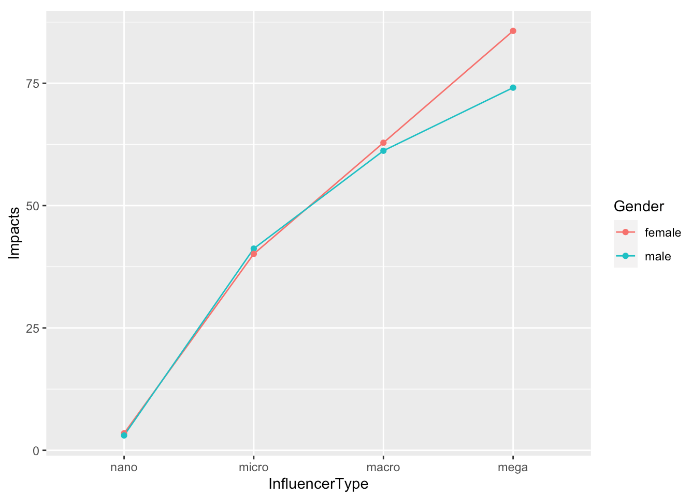

# Statistical Analyses of Three or More Variables & Modelling

## linear Regression

Because many concepts in social science are complicated and jointly influenced by multiple factors, can we consider their influences simultaneously? The answer is yes. We can use multiple factors to predict our dependent variable. If we want to predict impact more accurately, we can consider including more than one independent variable in our model.

Knowing the gender of the influencer would certainly help, but remember, that only explains 0.05% of the variance in impact. Could the influencer type make a difference, too? To find that out, we can include both the gender and influencer type as predictors in our regression model. We will still need to use the regression equation to predict the value of impact given the values of the predictors. 

```{r}
#Impact = b0 + b1*influencerType + b2*gender

#create factors
gender <- factor(data$Gender_D, c(0,1), labels=c('Male', 'Female'))
contrasts(gender)

influencer<-factor(data$InfluencerType_N, c(1,2,3,4), labels=c('nano', 'micro','macro','mega'))
contrasts(influencer)

model3 <- lm(data$Impact ~ gender + influencer)
summary(model3)

```

Because we have two independent variables now, the equation is **Impact = 3.06 + 0.39 * Gender + 37.40 * InfluencerMicro + 58.56 * InfluencerMacro +75.50 * InfluencerMega**. Note here that the variable of influencer type has been coded into three dummy variables with two values: 0 and 1. For example,Influencer Micro can take the value of either 0 or 1. When it takes the value of 1, it represents influencers at the micro level; when it takes the value of 0, it indicates that this influencer is not at the micro level. In other words, this influencer could be at nano, macro, or mega level.

To estimate the impact score, we just need to plug in the values of both predictors. If we have a male influencer at the micro level, the impact score would be 3.06 + 0.39 * 0 + 37.40 * 1 + 58.56 * 0 + 75.50 * 0 = 40.46. If it’s a female influencer at the mega level, her impact score would be 3.06 + 0.39 * 1 + 37.40 * 0 + 58.56 * 0 + 75.50 * 1 = 78.95, which is much higher compared to the male influencer at the micro level. You can see that the R-square of this model increased to 0.4 indicating 40% of variance in impact could be explained by gender and influencer type. 

## Interaction Effects

Furthermore, could the relationship between the influencer type and impact depend on the gender of Twitter authors? If we suspect that gender might further influence the direction and/or the strength of the relationship between the influencer type and impact score, we can add in an interaction term of gender and influencer type by multiplying these two terms.

```{r}
#interaction effects

model4 <- lm(data$Impact ~ gender*influencer)
summary(model4)

#visualization
data_2 <- data %>% 
  group_by(Gender, InfluencerType) %>% 
  summarise(Impact = mean(Impact)) %>%
  arrange(desc(Impact))

data_2$InfluencerType <- factor(data_2$InfluencerType,levels = c("nano", "micro", "macro", "mega")) #Re-order the sequence of influencer type

data_2 %>% 
  ggplot() +
  aes(x = InfluencerType, 
      y = Impact, 
      color = Gender) +
  geom_line(aes(group = Gender)) +
  geom_point()+ 
  ylab("Impacts")
```

From the above statistics and graph, you can see the significant interaction effect between gender and influencer type for predicting impacts. Male micro influencers had a little bit higher impacts than female micro influeners. But for other types of influencers, such as megas, males had lower impacts than females.

Could the relationship between the numbers of post and impact also depend on the gender of Twitter authors? Let's add in an interaction term of gender and the number of post by multiplying these two terms.


```{r}
#interaction effects of post and gender
post <- data$Post

model5 <- lm(data$Impact ~ post*gender)
summary(model5)

#model 5 visualization
ggplot(data) +
  aes(x = Post, y = Impact, color = Gender) +
  geom_point(color = "grey") +
  geom_smooth(method = "lm")+ 
  ylab("Impacts")

```

The above visualization and statistics shows significant interaction effects (p = 0.022) between gender and the numbers of post when predicting impact. But the R square is only 0.0027 indicating less than 0.3% of the variance in impact can be explained by this model.The R square of previous model of interaction between gender and the number of posts is 0.403, indicating more than 40% of the variance in impact can be explained by this regression model, and thus representing a better model for predicting impacts.

## Assignment 

### Linear Regression and Correlation

**Learning Objective**: Apply Linear Regression and Correlation analysis onto media analytics

**Step 1**. Download your google analytic data. (GA-regression&correlation.xlsx)

**Step 2**. Download the case study R code ( Casestudy-GA.R) to import and clean your data.

**Step 3**. Develop R code to run the regression analysis of:

a.	Users ~ Costs (Predicting Users using Costs)

b.	Revenue ~ Costs (Predicting Revenue using Costs)

**Step 4**. Develop R code to plot the two regressions with trendlines.

**Step 5**. Develop R code to run the correlation analysis between

a.	Users & Costs

b.	Revenue & Costs

**Step 6**. Write a report briefly summarizing the results of regression and correlation analysis. 

**Sample Report**

The results of correlation analysis indicated that there are strong negative correlations (r = -0.838) between Bounce Rate and Average Session Duration. The longer the Average Session Duration, the smaller the Bounce Rate.

The result of regression analysis is illustrated in the figure below. Specifically, the Bounce Rate could be predicted by the Average Session Duration.  The linear regression equation is: Y = – 0.00149X + 0.724.  The R^2 of the linear regression is 0.6961, indicating nearly 70% of the variance in Bounce Rate can be explained or predicted by the Average Session Duration.


### Multiple Regression Analysis

**Learning Objective**:  Apply Multiple Regression analysis onto media analytics.

**Step 1**. Download the data of tweets containing the co-hashtags of #BlackLivesMatter and #StopAsianHate from BrandWatch (Tools – Downloads – New - Select Query: BLS & SAH - Select a month data of your choice - Request Download). Download the data as an Excel file.

**Step 2**. Download the case study R code (Casestudy_ml.R) to import and clean your data.

**Step 3**. Develop your own code to run the multiple regression analysis of:

a.	Impacts ~ Gender + Influencer Type (Predicting Impacts using Gender and Influencer Type)

b.	Impacts ~ Gender * Influencer Type (Predicting Impacts using Gender * Influencer Type)

**Step 4**. Develop your own code to plot the interaction effects.

**Step 5**. Write a report briefly summarizing the results of the multiple regression analysis. (Sample report attached)


**Sample Report**

The result of the multiple linear regression analysis indicates that both gender and influencer type are significant predictors of impacts on the social media conversations of co-hashtags of #BlackLivesMatter and #StopAsianHate. The multiple linear regression equation is: Impact = 3.06 + 0.39 * GenderFemale + 37.40 * InfluencerMicro + 58.56 * InfluencerMacro + 75.50 * InfluencerMega. The R Square of the linear multiple regression is 0.4025, indicating 40% of the variance in Impact can be explained or predicted by gender and influencer type. 

We also found a significant interaction effect between gender and influencer type (F = 3.14, p = 0.02426). The related regression equation is: Impact = 3.06 + 0.43 * GenderFemale + 38.17 * InfluencerMicro + 58.17 * InfluencerMacro + 71.06 * InfluencerMega - 1.52 * GenderFemale * InfluencerMicro + 1.20 * GenderFemale * InfluencerMacro + 11.17 * GenderFemale * InfluencerMega. The R Square of the interaction model is 0.4026, slightly better than the model containing only main effects. 


The figure demonstrated the interaction effects: While females generally have more impacts on the social media conversations of co-hashtags of #BlackLivesMatter and #StopAsianHate, the female micro influencers’ impacts are slightly lower than male influencers.
