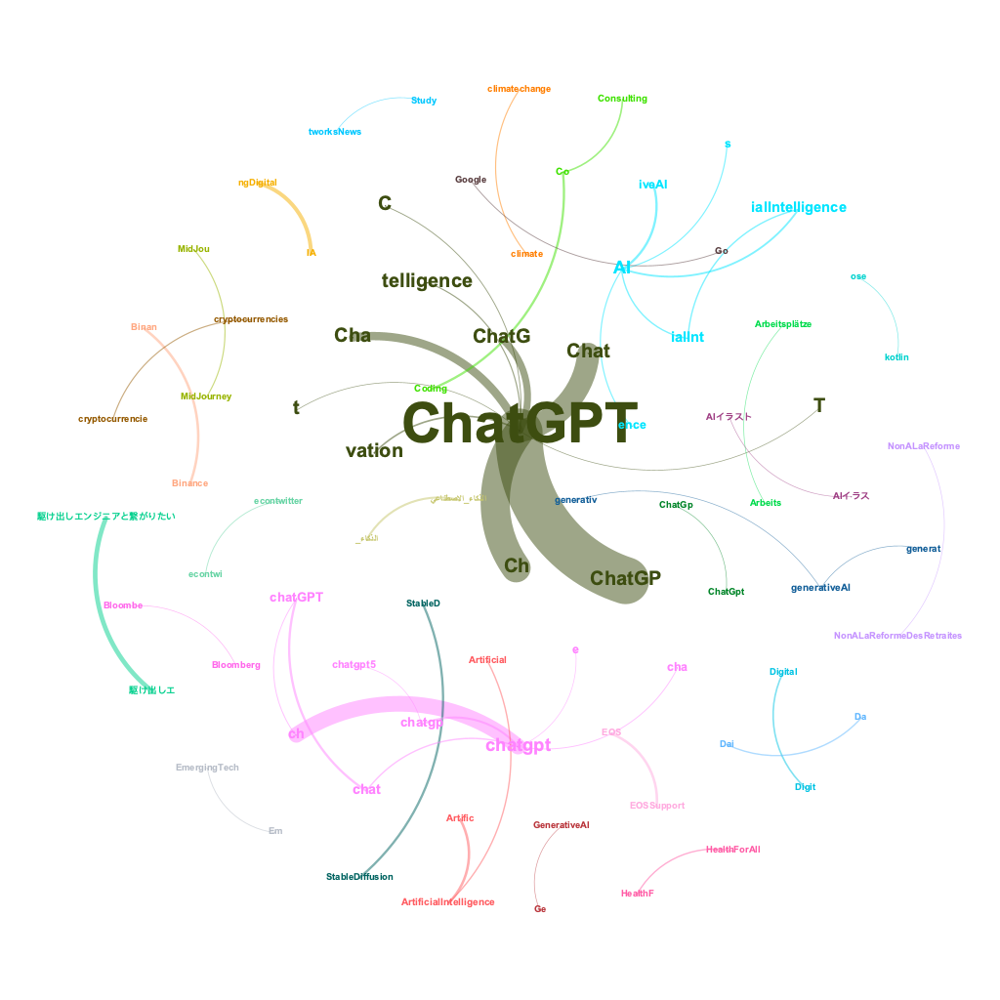
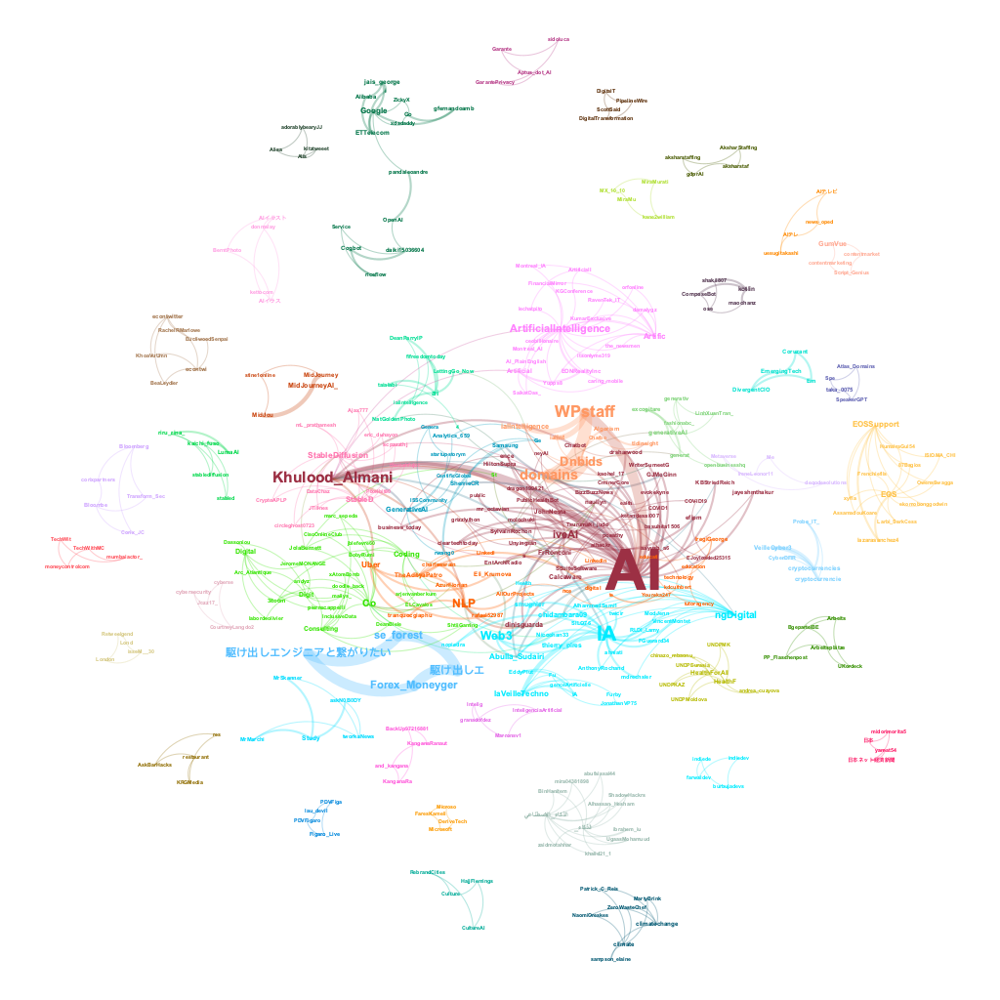

# Social Network Analysis 

## Introduction

Social Network Analysis (SNA) is a method of analyzing social structures by examining the relationships between social actors, such as individuals, organizations, or countries. In SNA, actors are represented as **nodes** or **vertices**, and relationships between them are represented as **links** or **edges**. The type of relationship can be **undirected** (e.g., friendship) or directed (e.g., **communication flow**), and it can also be **weighted** (e.g., strength of ties).

Here's an example R code to create a simple network graph:

```{r}
library(igraph)

# Create a sample graph with 4 nodes and 3 edges
g <- graph(edges=c(1,2,2,3,3,4), n=4, directed=FALSE)

# Plot the graph
plot(g, layout=layout.circle, vertex.label=1:4)
```
The graph() function from the igraph package is used to create the graph. The edges argument is used to specify the edges of the graph by passing a vector of node pairs. In this case, the graph is specified by passing the vector c(1,2,2,3,3,4), which means that there are three edges: (1,2), (2,3), and (3,4). The n argument is used to specify the number of nodes in the graph.

After creating the graph object g, the plot() function is used to visualize it. The layout.circle argument specifies that the graph should be displayed in a circular layout. The vertex.label argument specifies the labels for each node, in this case simply 1, 2, 3, and 4.

Social Network Analysis (SNA) involves several steps that researchers follow to understand the relationships and flows between social actors. The steps include:

**Designing the study**: The researcher selects appropriate research questions that will guide the study. For example, imagine you're a social butterfly who loves attending parties and making new friends. You're always curious about how people communicate and build relationships within a social circle. To explore this further, you decide to conduct a study on the patterns of communication within a social network. You want to understand how people interact, what topics they discuss, and how information spreads through the network.

**Identifying relevant data sources**: The researcher identifies data sources that will provide the necessary information to answer the research questions. For example, social media platforms like Twitter, Facebook, or LinkedIn can provide valuable data for a social network analysis.

**Collecting data**: Once the data sources are identified, the researcher collects the relevant data. Data can be collected through surveys, interviews, web scraping, or APIs.

**Analyzing data**: After collecting the data, the researcher analyzes it to identify patterns and structures in the network. There are several techniques and methods available for analyzing social network data, such as centrality measures, community detection, and network visualization.

**Reviewing data**: The researcher reviews the data to ensure that it is accurate and complete. This step involves checking for missing data, outliers, and errors.

**Preparing evaluation**: Once the data is reviewed, the researcher prepares an evaluation of the results. This step involves summarizing the findings and drawing conclusions based on the analysis.

**Moving into action**: Finally, the researcher moves into action by using the insights gained from the analysis to inform decision-making, policy development, or interventions. For example, a company may use the findings from a social network analysis to identify key influencers in their target market and develop targeted marketing campaigns.

## Centrality Measures

Centrality measures are important metrics in SNA that help to identify the most important nodes or actors in the network. **Degree centrality** measures the number of links that a node has to other nodes. **Closeness centrality** measures how close a node is to all other nodes in the network. **Betweenness centrality** measures the extent to which a node lies on the shortest paths between other nodes. **Eigenvector centrality** measures a node's importance based on the importance of its neighbors.

Here's an example R code to compute the centrality measures for a sample network graph:

```{r}

# Let's create a sample graph with 5 nodes and 6 edges
g <- graph(edges=c(1,2,1,3,2,3,2,4,3,5,4,5), n=5, directed=FALSE)

# Compute degree centrality
degree_centrality <- degree(g)

# Compute closeness centrality
closeness_centrality <- closeness(g)

# Compute betweenness centrality
betweenness_centrality <- betweenness(g)

# Compute eigenvector centrality
eigenvector_centrality <- eigen_centrality(g)$vector

# Plot the graph
plot(g, layout=layout.circle, vertex.label=1:5)

# Print the centrality measures for each node
for (i in 1:vcount(g)) {
  cat(paste("Node", i, ": Degree=", degree_centrality[i], 
            "Closeness=", closeness_centrality[i],
            "Betweenness=", betweenness_centrality[i], 
            "Eigenvector=", eigenvector_centrality[i], "\n"))
}

```

In this example, we create a sample network graph with 5 nodes and 6 edges. We then compute the four centrality measures (degree, closeness, betweenness, and eigenvector) for each node using the appropriate functions provided by the igraph package. Finally, we print out the centrality measures for each node.

The code above is using a for loop to iterate over each node in the graph, with the variable "i" representing the node index. Within the loop, the "cat" function is used to print a message that includes the centrality measures for that particular node. The "paste" function is used to concatenate the various pieces of information into a single string.

Note that the output will show the centrality measures for each node in the network. You can use these measures to identify the most important nodes or actors in the network based on the particular centrality measure of interest.

When the "cat" function is used to print a message, including the "\n" sequence in the message string will cause the output to be separated into multiple lines, with each new line starting after the "\n" character.

So in the code provided, including the "\n" sequence at the end of the message string ensures that each line of output corresponds to a single node in the graph, making it easier to read and interpret the output.

## Density, Reciprocity & Moduarity

Other important network metrics include **density**, which measures the proportion of possible connections that are present in the network, and **reciprocity**, which measures the extent to which relationships are mutual. **Modularity** measures the extent to which a network is divided into subgroups or modules.

Here are some R code examples to compute these network metrics:

```{r}
# Let's create a sample graph with 6 nodes and 8 edges
g <- graph(edges=c(1,2,1,3,2,3,2,4,3,4,3,5,4,5,5,6), n=6, directed=FALSE)

# Compute density
density <- graph.density(g)

# Print the density
cat(paste("The density of the network is", density, "\n"))
```

In this example, we create a sample network graph with 6 nodes and 8 edges. We then compute the density of the graph using the graph.density function provided by the igraph package. The output shows the density of the network. We can tell that approximately 53.33% of all possible edges are present in the above network.

A high network density can indicate a highly interconnected network, while a low density can indicate a more sparse or disconnected network. The specific interpretation of a density value depends on the context of the network being analyzed and the goals of the analysis.

```{r}
# Let's create another sample graph with 5 nodes and 7 edges
g <- graph(edges=c(1,2,1,3,2,3,3,4,4,3,4,5,5,4), n=5, directed=TRUE)

# Compute reciprocity
reciprocity <- reciprocity(g)

# Print the reciprocity
cat(paste("The reciprocity of the network is", reciprocity, "\n"))

```
In the above example, we create a sample directed network graph with 5 nodes and 7 edges. We then compute the reciprocity of the graph using the reciprocity function provided by the igraph package. The output shows the reciprocity of the network is .57, indicating that each pair of nodes in the network that are connected by a directed edge, approximately 57.14% of those pairs have reciprocal edges (i.e., edges going in both directions).

Reciprocity is an important measure of the symmetry of relationships in a network. A high reciprocity value indicates a high level of mutual connection or interaction between nodes, while a low reciprocity value indicates a more one-sided or unbalanced set of relationships.

The interpretation of a reciprocity value also depends on the context of the network being analyzed and the specific research question or hypothesis being tested.

```{r}

# Let's create a more dense graph with 10 nodes and 14 edges
g <- graph(edges=c(1,2,1,3,1,4,2,3,2,5,3,5,4,5,6,7,6,8,6,9,6,10,8,9,9,10), n=10, directed=FALSE)

# Compute modularity
modularity <- modularity(g, membership=clusters(g)$membership)

# Print the modularity
cat(paste("The modularity of the network is", modularity, "\n"))

```

In this example, we create a sample network graph with 10 nodes and 14 edges. We then compute the modularity of the graph using the modularity function provided by the igraph package. The membership argument is used to specify the clusters or modules in the network. The output shows modularity of the network is .49, indicating This means that the network has a relatively high degree of modularity, indicating that the above network can be partitioned into relatively distinct and densely connected groups of nodes.

But the specific interpretation of a modularity value depends on the context of the network being analyzed and the research question or hypothesis being tested. It is also worth noting that different methods of calculating modularity may yield slightly different values, and modularity values can be affected by factors such as network size, density, and edge weight.

In summary, SNA is a powerful method for analyzing social structures and relationships. By examining patterns of connections and interactions between social actors, SNA can help to identify key actors and structures in a network, and can inform interventions and policy decisions aimed at improving social outcomes.

## A Case Study of Social Networks from Twitter Conversations

This case study focuses on analyzing social networks from Twitter conversations. Three different types of networks were identified and analyzed: **Mention Network**, **Message Network**, **User-Sources Network**. 

### Mention Network

A mention network is a way to understand how Twitter users interact with each other. Each Twitter user is represented as a point in the network. When one user mentions another user in a tweet, a line is drawn from the mentioning user to the mentioned user. This line represents the interaction between the two users. The more often a user mentions another user, the stronger the line will be between them. The mention network can help researchers analyze patterns of communication on Twitter, identify important users or "hubs" in the network, find groups of users who tend to interact with each other frequently or "communities," and categorize user accounts based on their interactions with others.

Here's an example R code that uses the rtweet package to collect the most recent tweets containing the #ChatGPT hashtag, creates a mention network, performs some basic network analysis, and visualizes the network using the igraph package:

```{r}
library(rtweet)
library(igraph)
library(ggplot2)
library(tidyverse)

# search for tweets containing #ChatGPT and retrieve up to 5000 tweets
tweets <- search_tweets("#ChatGPT", n = 5000)

# extract mentions_screen_name column and drop NAs
mentions <- tweets %>% 
  select(screen_name, mentions_screen_name) %>% 
  filter(!mentions_screen_name == "NA")

# separate multiple mentions_screen_name into separate rows
mentions <- mentions %>% 
  separate_rows(mentions_screen_name, sep = ",") %>% 
  filter(!mentions_screen_name == "")

# create mention network data frame
mentions_net <- mentions %>% 
  group_by(screen_name, mentions_screen_name) %>% 
  summarize(weight = n()) %>% 
  ungroup()

# rename columns to source and target
colnames(mentions_net)[1:2] <- c("source", "target")

#export the mention network
write.csv(mentions_net, "~/Jenny/teaching/329/chatgpt_mention.csv", row.names=FALSE)

# create directed graph
mentions_graph <- graph_from_data_frame(mentions_net, directed = TRUE)

# Aggregate graph information
graph_info_me <- data.frame(
  Nodes = vcount(mentions_graph),
  Edges = ecount(mentions_graph),
  Avg_Link_Weight = ecount(mentions_graph)/vcount(mentions_graph),
  Density = edge_density(mentions_graph, loops = FALSE)
)

# View graph information
graph_info_me

#Centrality
options(scipen = 999) # turn off scientific notation for all variables
options(digits = 4) # define the digits 

# calculate centrality measures
indegree_me <- data.frame(name = V(mentions_graph)$name, indegree = degree(mentions_graph, mode = "in"))
outdegree_me <- data.frame(name = V(mentions_graph)$name, outdegree = degree(mentions_graph, mode = "out"))
closeness_me <- data.frame(name = V(mentions_graph)$name, closeness = closeness(mentions_graph, mode = "total"))
betweenness_me <- data.frame(name = V(mentions_graph)$name, betweenness = betweenness(mentions_graph, directed = TRUE, normalized = TRUE))
eigenvector_me <- data.frame(name = V(mentions_graph)$name, eigenvector = eigen_centrality(mentions_graph, directed = FALSE)$vector)

# combine into a single dataframe
centrality_me <- merge(indegree_me, outdegree_me, by = "name", all = TRUE)
centrality_me <- merge(centrality_me, closeness_me, by = "name", all = TRUE)
centrality_me <- merge(centrality_me, betweenness_me, by = "name", all = TRUE)
centrality_me <- merge(centrality_me, eigenvector_me, by = "name", all = TRUE)

```
We've got a whopping thousands of nodes in this mention network. For better-looking and more informative visualizations of large-scale networks, it's a good idea to use fancy network analysis and visualization tools like Gephi. You can grab a copy of Gephi here: https://gephi.org/users/download/

Gephi is a free and open-source network visualization and analysis tool that allows you to create complex and aesthetically pleasing network visualizations. It provides a user-friendly interface and a variety of tools for network analysis, including measures of centrality, clustering, and community detection.

For larger networks, Gephi can be more efficient and powerful than using R packages such as igraph and ggplot2. However, it does require some learning curve and familiarity with network analysis concepts.

This is the optimized network visualization generated by Gephi:


Well,look at what we have here! It's a stunning visualization of mentions! It appears that the recent ChatGPT discussions have triggered a plethora of mini-chat groups. Behold the rainbow-colored clusters that depict the top 10 mention communities. And guess who's hogging the limelight? Yup, you got it right, it's our very own trio of Twitter superstars - @B4l4kurwo, @CerfiaFR, and @datachaz!

Now, what's intriguing is that @B4l4kurwo is a social media influencer from Indonesia, @CerfiaFR is a French research center devoted to artificial intelligence, machine learning, and cognitive science, and @datachaz is a Twitter user passionate about data science and analytics. These three are acting as the central hubs for a massive gang of chatterboxes gabbing away about #ChatGPT. It's like they are the cool kids in school who have everyone eating out of their hands. Good for them!

### Message Network

A Twitter message network is a way to analyze how Twitter users communicate with each other using replies. Each Twitter user is represented as a point in the network. When one user sends a message to another user in reply to their tweet, a line is drawn from the sender to the receiver. This line represents the interaction between the two users. The more often a user sends a message to another user, the stronger the line will be between them. The message network can help researchers analyze patterns of communication on Twitter, identify important users or "hubs" in the network, find groups of users who tend to interact with each other frequently or "communities," and categorize user accounts based on their interactions with others. It is called a directed network because the lines have an arrow that points from the sender to the receiver, indicating the direction of the interaction.

```{r}
# extract reply_to_screen_name column and drop NAs
message <- tweets %>% 
  select(screen_name, reply_to_screen_name) %>% 
  filter(!reply_to_screen_name == "NA")

# create message network data frame
message_net <- message %>% 
  group_by(screen_name, reply_to_screen_name) %>% 
  summarize(weight = n()) %>% 
  ungroup()

# rename columns to source and target
colnames(message_net)[1:2] <- c("source", "target")

#export the message network
write.csv(message_net, "~/Jenny/teaching/329/chatgpt_message.csv", row.names=FALSE)

# create directed graph
message_graph <- graph_from_data_frame(message_net, directed = TRUE)

# Aggregate graph information
graph_info_ms <- data.frame(
  Nodes = vcount(message_graph),
  Edges = ecount(message_graph),
  Avg_Link_Weight = ecount(message_graph)/vcount(message_graph),
  Density = edge_density(message_graph, loops = FALSE)
)

# View graph information
graph_info_ms

#Centrality
options(scipen = 999) # turn off scientific notation for all variables
options(digits = 4) # define the digits 

# calculate centrality measures
indegree_ms <- data.frame(name = V(message_graph)$name, indegree = degree(message_graph, mode = "in"))
outdegree_ms <- data.frame(name = V(message_graph)$name, outdegree = degree(message_graph, mode = "out"))
closeness_ms <- data.frame(name = V(message_graph)$name, closeness = closeness(message_graph, mode = "total"))
betweenness_ms <- data.frame(name = V(message_graph)$name, betweenness = betweenness(message_graph, directed = TRUE, normalized = TRUE))
eigenvector_ms <- data.frame(name = V(message_graph)$name, eigenvector = eigen_centrality(message_graph, directed = FALSE)$vector)

# combine into a single dataframe
centrality_ms <- merge(indegree_ms, outdegree_ms, by = "name", all = TRUE)
centrality_ms <- merge(centrality_ms, closeness_ms, by = "name", all = TRUE)
centrality_ms <- merge(centrality_ms, betweenness_ms, by = "name", all = TRUE)
centrality_ms <- merge(centrality_ms, eigenvector_ms, by = "name", all = TRUE)

```

Now, let's visualize the network using Gephi.


The mention network was bustling with activity, with numerous nodes and edges capturing the buzz of ChatGPT discussions. However, the message network told a different story, revealing the smaller and occasional conversations taking place around the topic. It was here where characters like @aaditsh held court, acting as the central hub for these intriguing and occasional dialogues.

### User-Source Network

A user-source Twitter network is a type of undirected network that involves two types of nodes - users and sources. The links between these nodes are created based on the co-occurrence of users and the source of their tweets. For example, if a user sends a tweet from a particular source (e.g. Twitter Web App, Hootsuite, Tweetdeck), a link is created between the user and the source. The more often they appear together, the stronger the link between them.

This type of network can be used to explore the relationships between users and the sources they use to tweet. By analyzing the network, we can find and analyze which users use which clients (or sources). This information can be useful for understanding how users interact with different sources and for categorizing user accounts. 

```{r}
# extract source and drop NAs
UserSource <- tweets %>% 
  select(screen_name, source) %>% 
  filter(!source == "NA")

# create user-source network data frame
UserSource_net <- UserSource %>% 
  group_by(screen_name, source) %>% 
  summarize(weight = n()) %>% 
  ungroup()

# rename columns to source and target
colnames(UserSource_net)[1:2] <- c("source", "target")

#export the user-source network
write.csv(UserSource_net, "~/Jenny/teaching/329/UserSource_net.csv", row.names=FALSE)

# create undirected graph
UserSource_graph <- graph_from_data_frame(UserSource_net, directed = FALSE)

# Aggregate graph information
graph_info_us <- data.frame(
  Nodes = vcount(UserSource_graph),
  Edges = ecount(UserSource_graph),
  Avg_Link_Weight = ecount(UserSource_graph)/vcount(UserSource_graph),
  Density = edge_density(UserSource_graph, loops = FALSE)
)

# View graph information
graph_info_us

#Centrality
options(scipen = 999) # turn off scientific notation for all variables
options(digits = 4) # define the digits 

# calculate centrality measures
degree_us <- data.frame(name = V(UserSource_graph)$name, degree = degree(UserSource_graph, mode = "total"))
closeness_us <- data.frame(name = V(UserSource_graph)$name, closeness = closeness(UserSource_graph, mode = "total"))
betweenness_us <- data.frame(name = V(UserSource_graph)$name, betweenness = betweenness(UserSource_graph, directed = FALSE, normalized = TRUE))
eigenvector_us <- data.frame(name = V(UserSource_graph)$name, eigenvector = eigen_centrality(UserSource_graph, directed = FALSE)$vector)

# combine into a single dataframe
centrality_us <- merge(degree_us, closeness_us, by = "name", all = TRUE)
centrality_us <- merge(centrality_us, betweenness_us, by = "name", all = TRUE)
centrality_us <- merge(centrality_us, eigenvector_us, by = "name", all = TRUE)
```

Now, let's visualize the network using Gephi.


Wow, check out this sweet visualization! Despite the vast ocean of tweets out there, it seems like the three big players in the game are Twitter Web App, Twitter for Android, and Twitter for iPhone. These three musketeers have stolen the spotlight, leaving all other sources to cower in their digital shadow.

## A Case Study of Social-Semantic Networks of Twitter Conversations

A social-semantic network is a type of network that combines both social and semantic elements. In social networks, the focus is on the relationships between individuals, whereas in semantic networks, the focus is on the meaning or topics of the information being exchanged. Social-semantic networks, therefore, are networks that capture both the social relationships between individuals and the topics or themes of the conversations they have.

The case study examines two types of social-semantic networks, namely the Hashtag-User Network and the Hashtag-Mention network. In these networks, hashtags represent the semantics of the conversations, while user and mention represent the social aspect. The aim of this study is to sniff out the popular topics being chatted up by different groups of users. But before we get into all that jazz, let's take a gander at what the co-hashtag network looks like!

### Co-hashtag Network

A co-hashtag network is a special type of semantic network that explores the relationship between different hashtags on social media platforms like Twitter. In this network, the nodes represent hashtags and links are established between them based on co-occurrence. If two hashtags appear together in the same tweet, they are connected by a link. The more often two hashtags appear together, the stronger the link between them. This network helps to explore the relationships between hashtags, find and analyze sub-issues, and distinguish between different types of hashtags. By analyzing this network, we can identify communities of users who use similar hashtags and understand the topics and issues that they are interested in.

```{r}
# extract status_id & hashtag and drop NAs
Hash <- tweets %>% 
  select(status_id, hashtags) %>% 
  filter(!hashtags == "NA")

# separate multiple hashtags into separate rows
Hash <- Hash %>% 
  separate_rows(hashtags, sep = ",") %>% 
  filter(!hashtags == "")

# count words co-occuring within sections
library(widyr)
word_pairs_hash <- Hash %>%
  pairwise_count(hashtags, status_id, sort = TRUE)

colnames(word_pairs_hash)[1] <- "Source"
colnames(word_pairs_hash)[2] <- "Target"
colnames(word_pairs_hash)[3] <- "Weight"

#calculate the mean weight for the word links, then re-do the wordpair
mean(word_pairs_hash$Weight)

word_pairs_hash <- word_pairs_hash %>%
  filter(Weight > mean(word_pairs_hash$Weight))

write.csv(word_pairs_hash, "~/Jenny/teaching/329/hash.csv", row.names=FALSE)

# create undirected graph
hash_graph <- graph_from_data_frame(word_pairs_hash, directed = FALSE)

# Aggregate graph information
graph_info_hash <- data.frame(
  Nodes = vcount(hash_graph),
  Edges = ecount(hash_graph),
  Avg_Link_Weight = ecount(hash_graph)/vcount(hash_graph),
  Density = edge_density(hash_graph, loops = FALSE)
)

# View graph information
graph_info_hash

#Centrality
options(scipen = 999) # turn off scientific notation for all variables
options(digits = 4) # define the digits 

# calculate centrality measures
degree_hash <- data.frame(name = V(hash_graph)$name, degree = degree(hash_graph, mode = "total"))
closeness_hash <- data.frame(name = V(hash_graph)$name, closeness = closeness(hash_graph, mode = "total"))
betweenness_hash <- data.frame(name = V(hash_graph)$name, betweenness = betweenness(hash_graph, directed = FALSE, normalized = TRUE))
eigenvector_hash <- data.frame(name = V(hash_graph)$name, eigenvector = eigen_centrality(hash_graph, directed = FALSE)$vector)

# combine into a single dataframe
centrality_hash <- merge(degree_hash, closeness_hash, by = "name", all = TRUE)
centrality_hash <- merge(centrality_hash, betweenness_hash, by = "name", all = TRUE)
centrality_hash<- merge(centrality_hash, eigenvector_hash, by = "name", all = TRUE)

```
Let's first take a look at the co-hashtags visualization from Gephi.



As we gaze upon the visual representation of #ChatGPT conversations, we can spot the major hashtag clusters that have emerged. But wait, there's more! Now, let's delve deeper into the minds of different user groups. How are they using these hashtags? Which influencers are being mentioned in relation to different topics? To answer these burning questions, let's take a gander at the Hashtag-User network and the Hashtag-Mention network. 

### Hashtag-User Network

A Hashtag-User network is a type of network where hashtags and Twitter users are the nodes, and the links between them represent the co-occurrence of a user and a hashtag in a tweet. For example, if a user wrote a tweet with a certain hashtag, there will be a link between that user and the hashtag in the hashtag-user network. The strength of the link is based on how often the user and the hashtag appear together in tweets.

This type of network can be used to explore the relationship between users and hashtags, find out which users are interested in which topics, and analyze the patterns of communication among different user groups on Twitter.

Let's leverage the #ChatGPT tweets we've collected to showcase how to build a Hashtag-User network:

```{r}
# extract hashtags and drop NAs
UserHash <- tweets %>% 
  select(screen_name, hashtags) %>% 
  filter(!hashtags == "NA")

# separate multiple hashtags into separate rows
UserHash <- UserHash %>% 
  separate_rows(hashtags, sep = ",") %>% 
  filter(!hashtags == "")

# create hashtag-user network data frame
UserHash_net <- UserHash %>% 
  group_by(screen_name, hashtags) %>% 
  summarize(weight = n()) %>% 
  ungroup()

# rename columns to source and target
colnames(UserHash_net)[1:2] <- c("source", "target")

#export the hashtag-user network
write.csv(UserHash_net, "~/Jenny/teaching/329/UserHash_net.csv", row.names=FALSE)

# create undirected graph
UserHash_graph <- graph_from_data_frame(UserHash_net, directed = TRUE)

# Aggregate graph information
graph_info_uh <- data.frame(
  Nodes = vcount(UserHash_graph),
  Edges = ecount(UserHash_graph),
  Avg_Link_Weight = ecount(UserHash_graph)/vcount(UserHash_graph),
  Density = edge_density(UserHash_graph, loops = FALSE)
)

# View graph information
graph_info_uh

#Centrality
options(scipen = 999) # turn off scientific notation for all variables
options(digits = 4) # define the digits 

# calculate centrality measures
degree_uh <- data.frame(name = V(UserHash_graph)$name, degree = degree(UserHash_graph, mode = "total"))
indegree_uh <- data.frame(name = V(UserHash_graph)$name, indegree = degree(UserHash_graph, mode = "in"))
outdegree_uh <- data.frame(name = V(UserHash_graph)$name, outdegree = degree(UserHash_graph, mode = "out"))
closeness_uh <- data.frame(name = V(UserHash_graph)$name, closeness = closeness(UserHash_graph, mode = "total"))
betweenness_uh <- data.frame(name = V(UserHash_graph)$name, betweenness = betweenness(UserHash_graph, directed = FALSE, normalized = TRUE))
eigenvector_uh <- data.frame(name = V(UserHash_graph)$name, eigenvector = eigen_centrality(UserHash_graph, directed = FALSE)$vector)

# combine into a single dataframe
centrality_uh <- merge(degree_uh, indegree_uh, by = "name", all = TRUE)
centrality_uh <- merge(centrality_uh, outdegree_uh, by = "name", all = TRUE)
centrality_uh <- merge(centrality_uh, closeness_uh, by = "name", all = TRUE)
centrality_uh <- merge(centrality_uh, betweenness_uh, by = "name", all = TRUE)
centrality_uh <- merge(centrality_uh, eigenvector_uh, by = "name", all = TRUE)

```

Check out these two Gephi visualizations of the Hashtag-User Network. The first one is a wild and colorful representation of all the different topic clusters that emerged around various influencers in the ChatGPT conversation.


But if you want to get to the juicy center of the network, the second visualization is where it's at. We stripped away all the ChatGPT-related hashtags like #Chat and #ChatGPT to really hone in on the core of the network. No surprise,  the main focus is on AI - not like we can escape it, right? But hey, check this out - turns out that our friend @khulood_almani, an Assistant Professor in Computer and Information from Saudi Arabia, seems to be a real chatterbox when it comes to the topic of AI.



### Hashtag-Mention Network

A Hashtag-Mention network is a type of undirected network that involves two types of nodes: hashtags and @mentions. In this network, a link is created between a hashtag and an @mention if they co-occur in a tweet. The link weight is determined by the frequency of co-occurrence, meaning that the more often a hashtag and an @mention appear together, the stronger the link between them.

The primary use of a hashtag-mention network is to explore the relational activity between mentioned users and hashtags, which allows for the identification of users who are considered experts around particular topics. By analyzing this network, one can understand which hashtags are frequently mentioned together and which users tend to be mentioned together with certain hashtags.

```{r}
# extract hashtag & mention and drop NAs
HashMe <- tweets %>% 
  select(hashtags, mentions_screen_name) %>% 
  filter(!hashtags == "NA") %>% 
  filter(!mentions_screen_name == "NA")

# separate multiple hashtags into separate rows
HashMe <- HashMe %>% 
  separate_rows(hashtags, sep = ",") %>% 
  filter(!hashtags == "")

# separate multiple mentions into separate rows
HashMe <- HashMe %>% 
  separate_rows(mentions_screen_name, sep = ",") %>% 
  filter(!mentions_screen_name == "")

# create hashtag-mention network data frame
HashMe_net <- HashMe %>% 
  group_by(hashtags, mentions_screen_name) %>% 
  summarize(weight = n()) %>% 
  ungroup()

# rename columns to source and target
colnames(HashMe_net)[1:2] <- c("source", "target")

#export the hashtag-mention network
write.csv(HashMe_net, "~/Jenny/teaching/329/HashMe_net.csv", row.names=FALSE)

# create undirected graph
HashMe_graph <- graph_from_data_frame(HashMe_net, directed = TRUE)

# Aggregate graph information
graph_info_um <- data.frame(
  Nodes = vcount(HashMe_graph),
  Edges = ecount(HashMe_graph),
  Avg_Link_Weight = ecount(HashMe_graph)/vcount(HashMe_graph),
  Density = edge_density(HashMe_graph, loops = FALSE)
)

# View graph information
graph_info_um

#Centrality
options(scipen = 999) # turn off scientific notation for all variables
options(digits = 4) # define the digits 

# calculate centrality measures
degree_um <- data.frame(name = V(HashMe_graph)$name, degree = degree(HashMe_graph, mode = "total"))
indegree_um <- data.frame(name = V(HashMe_graph)$name, indegree = degree(HashMe_graph, mode = "in"))
outdegree_um <- data.frame(name = V(HashMe_graph)$name, outdegree = degree(HashMe_graph, mode = "out"))
closeness_um <- data.frame(name = V(HashMe_graph)$name, closeness = closeness(HashMe_graph, mode = "total"))
betweenness_um <- data.frame(name = V(HashMe_graph)$name, betweenness = betweenness(HashMe_graph, directed = FALSE, normalized = TRUE))
eigenvector_um <- data.frame(name = V(HashMe_graph)$name, eigenvector = eigen_centrality(HashMe_graph, directed = FALSE)$vector)

# combine into a single dataframe
centrality_um <- merge(degree_um, indegree_um, by = "name", all = TRUE)
centrality_um <- merge(centrality_um, outdegree_um, by = "name", all = TRUE)
centrality_um <- merge(centrality_um, closeness_um, by = "name", all = TRUE)
centrality_um <- merge(centrality_um, betweenness_um, by = "name", all = TRUE)
centrality_um <- merge(centrality_um, eigenvector_um, by = "name", all = TRUE)

# plot the top 10 nodes for different centrality measure
top_degree_um <- head(centrality_um[order(-centrality_um$degree),], 10)
top_indegree_um <- head(centrality_um[order(-centrality_um$indegree),], 10)
top_outdegree_um <- head(centrality_um[order(-centrality_um$outdegree),], 10)
top_closeness_um <- head(centrality_um[order(-centrality_um$closeness),], 19)
top_betweenness_um <- head(centrality_um[order(-centrality_um$betweenness),], 10)
top_eigenvector_um <- head(centrality_um[order(-centrality_um$eigenvector),], 10)

ggplot(top_indegree_um, aes(x = reorder(name, indegree), y = indegree, fill = betweenness)) +
  geom_bar(stat = "identity") +
  ggtitle("Top 10 nodes by indegree centrality") +
  xlab("Node") +
  ylab("indegree") +
  theme_minimal() +
  theme(axis.text.x = element_text(angle = 90, vjust = 0.5))
#top indegree refers to top mentions

ggplot(top_outdegree_um, aes(x = reorder(name, outdegree), y = outdegree, fill = betweenness)) +
  geom_bar(stat = "identity") +
  ggtitle("Top 10 nodes by outdegree centrality") +
  xlab("Node") +
  ylab("outdegree") +
  theme_minimal() +
  theme(axis.text.x = element_text(angle = 90, vjust = 0.5))
#top outdegree refers to top hashtags
```
The **axis.text.x** refers to the x-axis labels, and element_text() is a function that allows you to set the text properties of an element in a plot. The angle argument rotates the labels by the specified angle (in degrees), while the vjust argument sets the vertical justification of the text to adjust the position of the labels. In this case, vjust = 0.5 centers the labels vertically.

Therefore, theme(axis.text.x = element_text(angle = 90, vjust = 0.5)) is used to rotate the x-axis labels by 90 degrees and center them vertically in a ggplot2 chart. This is commonly used when the labels are long or numerous and overlap each other, making them difficult to read horizontally.

Now, let's see the network visualizations from Gephi.


Behold the grandeur of the ChatGPT network visualization, for it reveals that the vibrant topics swirling around this phenomenon were expertly guided by a diverse cast of influencers. The likes of @OpenAI, @YouTube, @Khulood_Almani, @enricomolinari, @FrRonconi, @sonu_monika, @Khulood_Alm, @DataChaz, @Forbes, and @elonmusk loomed large as the virtuosos of the ChatGPT domain.

