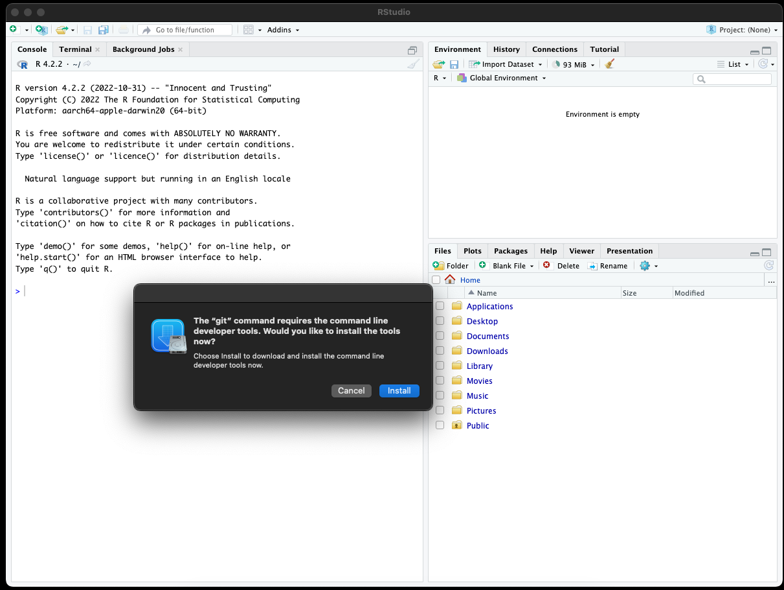
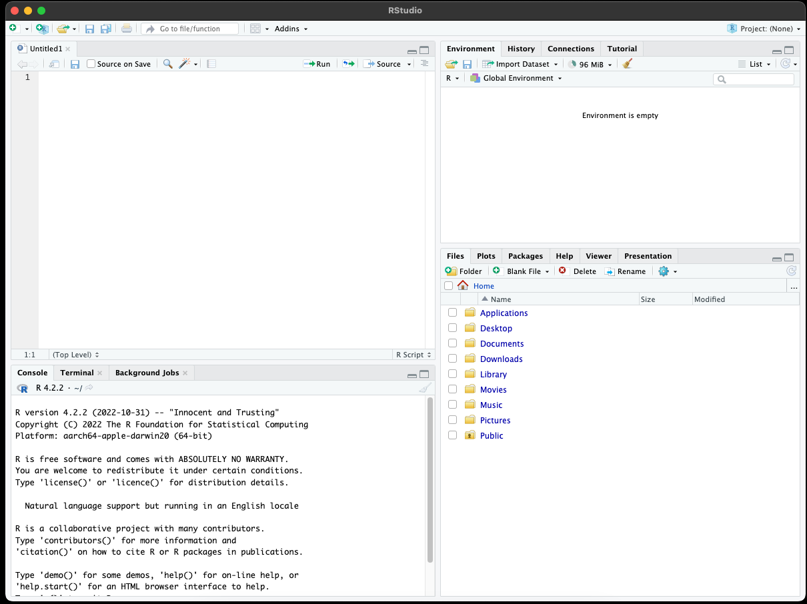
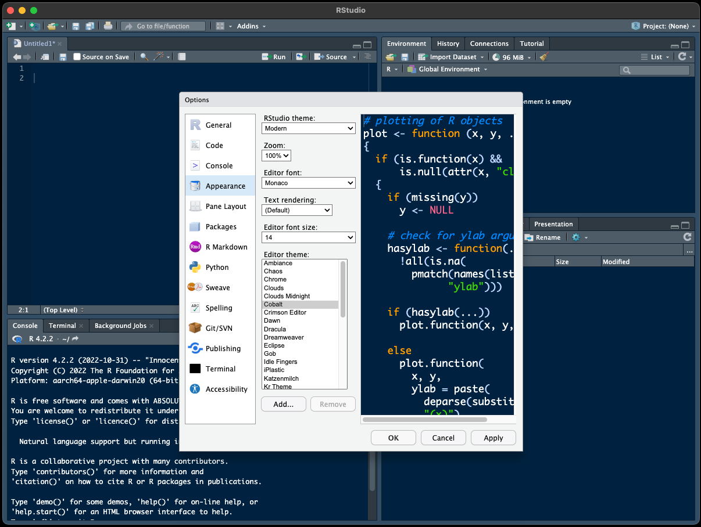
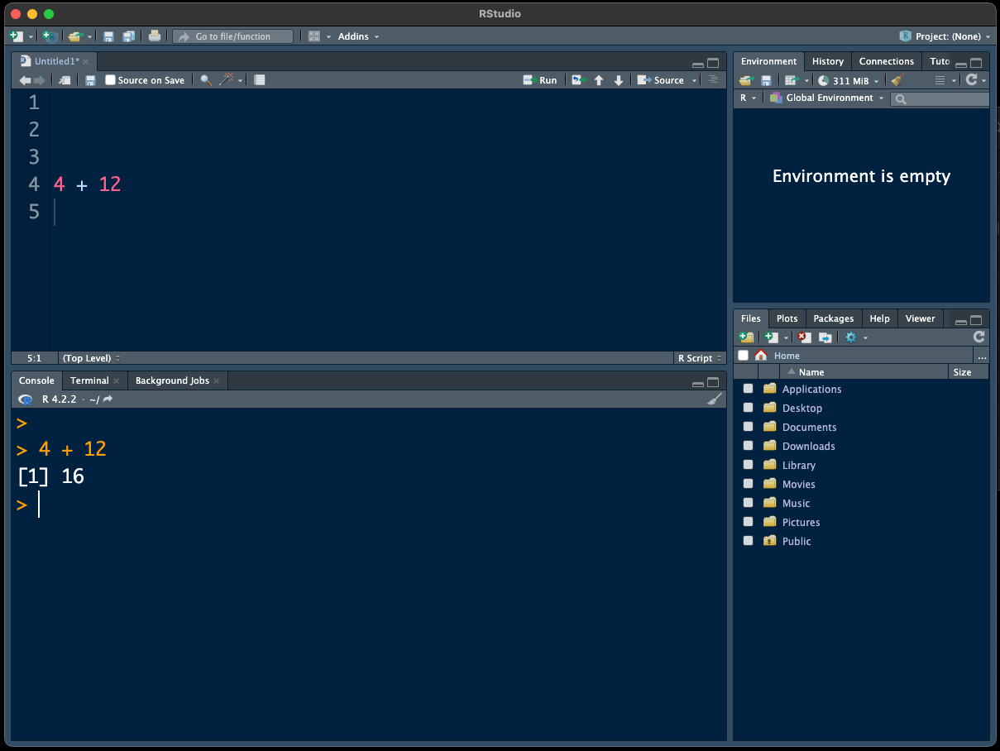
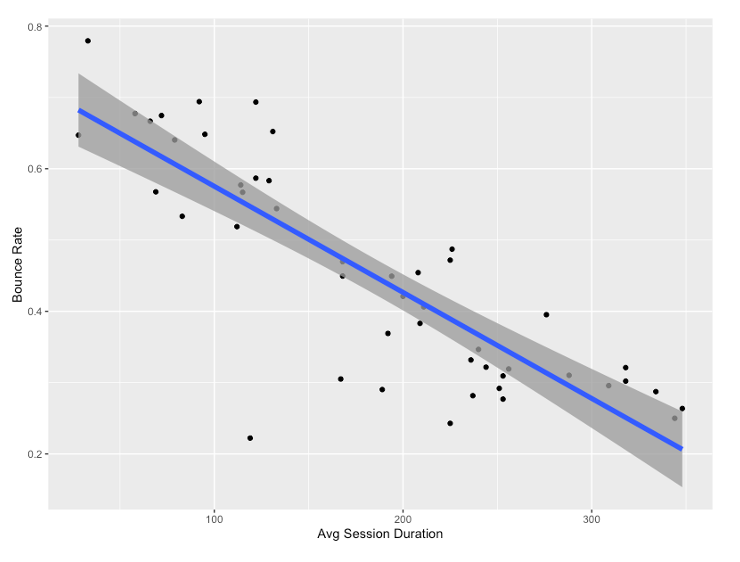
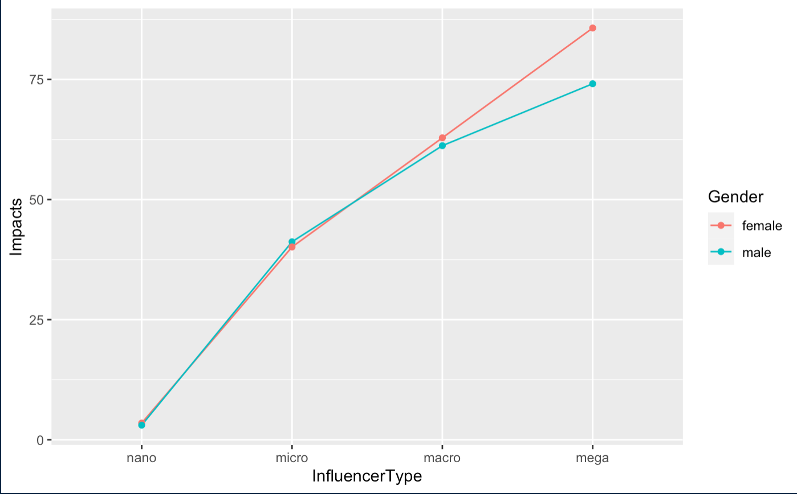

--- 
title: "Media Analytics With R"
author: "Jenny Jiang & Brian Walsh"
date: "`r Sys.Date()`"
site: bookdown::bookdown_site
---

# Preface {-}

The rapid development of information technology, along with the emergence of big data in the field of digital media, projects a workforce shortage for data-driven positions. In particular, the ability to use statistics to analyze and interpret the data obtained from tracking user interactions on websites and social media platforms make Communications students stand out in competitive job markets from a variety of industries.

However, the integration of analytics into universities’ communication programs and curricula (e.g., Journalism, Television and Cinema, Public Relations, Strategic Communications, Communication Design, Health Communication, Sports Communication, Environmental Communication) is yet to catch up to the industry’s new demands. 

To address this need, this book introduces Communication students to R, which is a free software environment for statistical computing and graphics, to measure and analyze audiences’ digital footprints, employ data-driven problem solving to gauge audience engagement, formulate insights, plan and execute strategies, and evaluate outcomes.

## Who is this book for?

Anyone who wants to learn basic data methodology and how to use the R programming language. Specifically, this book relies on analyzing text and social media and focuses on creating effective visualizations and avoiding methodological errors. R is a statistical programming language, but we'll be using it in a way that doesn't require that you have an extensive statistical background.

## Why R?

First of all, R is free, open-source, and runs on any OS. It is used by many professional journalistic and scientific organizations (The Guardian, the New York Times, etc.) for statistical analysis and data visualization.

R is a package-based language, meaning it downloads only the core functions and requires users to customize it to their needs. It therefore takes up a smaller amount of disc space and is highly customizeable.

A common issue with package-based languages is that the packages are all designed separately, and there are frequent compatibility issues. A solution to this problem in R, known as the tidyverse, combines a number of packages that are designed to work seamlessly with each other to deal with data manipulation, time adjustment, working with strings, importing data, and more.

R is a language, and its IDE, R Studio -- the software we run R 'inside' of -- adds a number of capabilities that make working in R easier, including the capability of publishing your R analysis directly to the web, as well as PDF, EPUB and .docx formats, and integrates with GitHub for version control.

R Studio is capable of also working and publishing using multiple programming languages (Python, Julia, Observable), as well as text, images and interactive visualizations, so you can easily publish and share a completed data analysis project effortlessly. In fact, this entire textbook was written and published using R and R Studio (repo available here).

## What will we learn to do with R in this book?

We'll start by learning the syntax of the tidyverse, which will then be used throughout the book. Using some example data sets, the book starts with data visualization so we can immediately see results from our programming.

After learning the basics of formatting and visualizing data, we'll focus on analyzing bodies of text, from great literature to social media. We'll learn how to perform a network analysis to discover online connections between social accounts. We'll also learn to make maps overlaid with data and how to avoid common methodological pitfalls.

## Installing the Software

R and R Studio must be installed separately on your computer. Start with R, by going to <https://cran.rstudio.com/> and choosing a version based on the Operating System you are using. Clicking on the Mac installation brings you to a page to choose which version to download; just download the latest one for your OS (note that there are separate versions for newer and older Macs). The downloaded file is a .pkg file, which you can double-click to install R into the default location on your Mac. On a PC, the link leads you to download the base, which is what you want when first installing R.

Then download R Studio from <https://posit.co/downloads/>. I recommend the 'free' version.

Once everything is installed, launching R Studio should automatically load R, and you're ready to go.

## Getting Started

Launching R Studio should lead you to a screen like this one:



I'm getting a pop-up that is asking me to install *git*, which will allow R Studio to run *version control*. This is all above our paygrade right now, but I can tell you that this pop-up won't go away completely until you succumb to its demands and install the git tools.

The R Studio interface is divided into 4 quadrants, but only 3 are visible at first: you have to click on the little 'mimimize/maximize' button to open the 'Source' tab in the upper-right. This is where we will write all of our R code, which we will then 'send down' to the console below it - the idea is that by writing the code in the 'Source' window, we can re-run it if we need to change anything.

R Studio should look like this now:



I personally feel that a) no one should write computer code on a white screen with black text and b) no one should write code, especially in a language that is new to them, in a 10-point font that's hard to read. Let's change those things by going to 'Tools' \> 'Global Options,' and adjusting the 'Appearance' of R Studio by changing the theme and the font size:



Once complete, we'll want to get used to writing our R code in the upper-left 'Source' tab. Here's an example: I've typed '4 + 12' into the 'Source' tab; now I'll click the 'Run' button to execute the code and see the results in the console. The very useful shortcut for 'Run' is 'Command-Enter' (Mac) or Control-Enter (PC). Try it!



## R Studio Projects

One of the most common issues new R users run into is 'finding' all of their materials on their computer's hard drive: their R scripts, their data files, and anything else needed to put together a report and, potentially, publish it.

The easiest way to avoid this common pitfall is to create a *project* for each new task you're doing in R. Creating a project requires that you specify a project *folder*, and then all you have to do is put your project's assets in there.

I'd recommend you create a new project for each of the hands-on coding chapters in this book. Not only will it be easier to load your data files, it'll also make it much easier to publish successfully.

OK, we're now ready to get introduced to the *tidyverse* and make our first visualizations.


<!--chapter:end:index.Rmd-->

# Intro to Programming in R

```{r setup, include=FALSE}
knitr::opts_chunk$set(echo = TRUE)
library(babynames)
library(tidyverse)

```

## Creating a New Project in R Studio

I recommend you start by creating a *new project* for this intro chapter.

Choose 'File' -\> 'New Project...' In the popup that follows, choose 'New Directory,' then 'New Project,' and choose (or create) a location for your project folder.
You can leave all the other options as-is.
Your popup should look something like this:

{fig-alt="popup"}

Once you've created a project, choose 'File' -\> 'New File' -\> 'R Script.' This will open up the Source pane and create a new, blank file.
Let's save it: 'File' -\> 'Save' - and it will automatically save in our project's folder.

OK, let's get coding!

## Loading Packages and Data

The U.S. Social Security Administration keeps records on first names at birth, going back to 1890.
Data Scientist and R Superstar Hadley Wickham has created an R *package* that lets us load this data directly into R.

Using a package is a two-step process: first, you install the package onto your computer; secondly, you *load* *the* *package* as a *library* to access its functions and data in your current work environment.

Put another way, a package needs only be installed *once*, but has to be loaded into your R environment *every time you start up R Studio.*

```{r, babynames_packages, eval=FALSE}
install.packages('babynames')
library(babynames)

```

Where do these packages come from, and who makes them?
Why?
By default, packages are hosted on an online repository referred to as CRAN; they can also be installed from GitHub.
And anyone can make and share an R package, for instance if they solve a complicated workflow and want to share that insight with others to save them time and redundancy.
Having R package-based means that users only need to load packages relevant to their area of study - keep in mind R is used for everything from Health Sciences to Comparative Literature.

Let's take a look at the *babynames* package, by asking about its *structure*, and taking a *glimpse* at it:

```{r, babynames_str}

str(babynames)

glimpse(babynames)
```

The output of *glimpse* is a little overwhelming at first, although it makes clear there are a lot of rows in it (Excel cannot handle 1,924,665 rows of data, but this is *still* not 'Big Data').

So let's try *head* and *tail* to see the first and last 10 rows of the dataset:

```{r, babynames_head_tail}
head(babynames, n=10)
tail(babynames, n=10)
```

Everything we've done up to this point has been in *Base R*, that is, R without any functions added via packages.
Throughout this book, we'll be relying on a collection of inter-connected packages called the [*Tidyverse*](https://www.tidyverse.org/ "Tidyverse"){target="_blank"}, which drastically simplifies performing varying calculations on data.

Like all packages, we first have to install and then load it.

• Please note: when you install the 'tidyverse' package, you'll get a prompt *inside your R Console* at the bottom-left, asking you a Yes/No question.
You cannot proceed until you click your cursor in the Console and type out the word 'Yes.' Note that the Console may be cut off or obfuscated; you may need to adjust your R Studio windows to see it better.

```{r, tidyverse_load, eval = FALSE}
install.packages('tidyverse')
library(tidyverse)
```

Loading the Tidyverse shows the eight packages that make it up, as well as a few warnings that we can disregard.
We'll begin on focusing on three packages that will help us work with babynames: *dplyr*, *ggplot2* and *stringr*.
All three are loaded once we run the library(tidyverse) command.
The first, dplyr, we use to manipulate data: to filter it, rearrange it,count it, do calculations for custom columns, and pivot the data to our liking.

## %\>%

The greatest and most powerful functionality added to R via the Tidyverse, in my opinion, is the 'pipe operator:'

%\>%

...which allows us to chain commands to each other.
It can be tricky to type; the shortcut is Shift-Command-M (on a PC, it'd be Shift-Control-M).

Another useful *logical operator* for this dataset is the 'includes' operator, which looks like this: %in% .

I think an example will make the best sense of how to use these operators, so let's get started with filtering.

## Filtering Data

If we just type 'babynames' in R, we'll see the first 10 rows of data, organized by year, and an indication that there are nearly 2 million more rows remaining.
That's way too much to visualize!
Let's start by filtering for specific names: I'll use the names of The Beatles as a starting point.

```{r, babynames_beatles}
babynames %>% 
  filter(name %in% 'Ringo')


```

That 'translates' to *'take the babynames dataset and filter it so only values in the name column that match 'Ringo' are included.'* The *and* is the pipe operator ( **%\>%** ), and the *match* is the **%in%** operator.

If we wanted to look for more than one name, we'd change the syntax to use a 'combine' command ( c ), with the values comma-separated.
Let's try that with babynames and the Beatles.

```{r, babynames_beatles2}
  babynames %>% 
  filter(name %in% c('Ringo', 'Paul', 'George', 'John')) 

```

Now we get a ton of results - far too many to show on the screen.

## Visualizing

That's where data visualization comes in: it's often impossible to even *see* your results from big data without plotting it into a visual, summarized form.
Our visualization package is called *ggplot2*, and it's amazingly straightforward to use, once you get used to its syntax:

ggplot(data, aes(x,y)) + geometry()

Huh?

Well, our function (think: verb) is 'ggplot().' Inside that, we define our 'aesthetics' (aes) for the visualization, which has its own set of parentheses.
Inside the aesthetics, we define the columns we want to use for the x and y axes, and finally we define the type of geomtry our visualization will use, such as a bar chart ( geom_col() ), scatterplot ( geom_point() ), or line chart ( geom_line() ), for instance.

Like most things in R and the Tidyverse, it's easier to make sense of ggplot() through examples:

```{r, babynames_ggplot1}

babynames %>% 
  filter(name %in% 'Ringo') %>% 
  ggplot(aes(year, prop)) + geom_line()

```

To review, we take 'babynames,' *and* filter so the name *includes* 'Ringo;' We then *plot* by setting the *aesthetics* to use the 'year' and 'prop' columns of our dataset; our plot will be a line chart.

Learning by example often raises as many questions as it answers, so I'll try to address those as we go along.

Let's take this one step further:

```{r, babynames_ggplot2}

babynames %>% 
  filter(name %in% c('Ringo', 'John', 'George', 'Paul')) %>% 
  ggplot(aes(year, prop, color = name)) + geom_point()

```

That looks really weird!
Why?
In summary, becuase there is a 'Sex' column in the data.
So, for any year - say, 1974 - there are 4 male Ringo's, and zero female Ringo's - ggplot is trying to plot both the 4 and 0 values on the same vertical axis.

Therefore, our solution is to filter out one sex:

```{r, babynames_ggplot3}

babynames %>% 
  filter(name %in% c('Ringo', 'John', 'George', 'Paul')) %>% 
  filter(sex %in% "M") %>% 
  ggplot(aes(year, prop, color = name)) + geom_line()

```

That's much better - but what happened to Ringo?

The other names are so much more popular that his: he doesn't show up until 1964, and the *proportion* of people born per year with that name is very low in comparison to, say, 'George.'

Let's try filtering the 'year' column in order to have our ggplot 'zoom in' on the Ringo section.

```{r, babynames_years}

babynames %>% 
  filter(name %in% c('Ringo', 'John', 'George', 'Paul')) %>% 
  filter(sex %in% "M") %>% 
  filter(year > 1964) %>% 
  ggplot(aes(year, prop, color = name)) + geom_line()


```

This visualization is more limited, but somewhat more equitable - it starts around the time the Beatles became popular, but ignores the previous popularity of some of the names (John, Paul, George).

Another question arises: why are we plotting 'prop?'
what about 'n?'

```{r, babynames_n}

babynames %>% 
  filter(name %in% c('Ringo', 'John', 'George', 'Paul')) %>% 
  filter(sex %in% "M") %>% 
  filter(year > 1964) %>% 
  ggplot(aes(year, n, color = name)) + geom_line()


```

The results are very similar for 'n' as they were for 'prop.' Let's take an example name where that's *not* the case:

```{r, babynames_n2, out.width=c('50%', '50%'), fig.show='hold' }

babynames %>% 
  filter(name %in% "Mary") %>% 
  filter(sex %in% "M") %>% 
  filter(year < '1940') %>% 
  ggplot(aes(year, prop)) + geom_line()

babynames %>% 
  filter(name %in% "Mary") %>% 
  filter(sex %in% "M") %>% 
  filter(year < '1940') %>% 
  ggplot(aes(year, n)) + geom_line()

# you can also try 'Joseph' and 'M'

```

Note that n is a *simple count of names per year*, whereas prop is a calculation: *total number of people given that number in a given year, divided by the total number of births*.
So when there are fewer names in the database, the difference between n and prop is more obvious.
That'd be in the early years of the babynames dataset, when biblical names like Mary and Joseph were much more common relative to *all* of the names.
Since then, there are just *more* names, meaning the prop of the most common names of long ago have nearly all gone down in prop - even if their n value is increasing.

```{r babynames_count_hidden,  class.source = 'fold-hide'}
 # note that we have not learned how to do this yet:

 babynames %>% 
    group_by(year) %>% 
    summarize(total = n_distinct(name)) %>% 
    ggplot(aes(year, total)) + geom_line() +
  xlab('Year') + ylab('Count of Unique Names')
  
```

Now that we have all of this information, we can try to answer specific questions.
Let's start with some basic ones - try to answer them on your own if you can.

<ul>

<li>

What was the most popular name in the first year of the database, 1890?

```{r, babynames_cs1}
babynames %>% 
  filter(year == "1890")

```

But then what?
Any why two '=' symbols?

## Syntax

Let's start with '=.' In R, you can create variables, and one way to do this is with a single '=' symbol:

```{r babynames_equals1}
x = 10
```

In the case of babynames, we're not aiming to create a variable - we just want to limit the data to only include entries in the year 1890 - so we need to use two '=' symbols to differentiate from making a variable.
Two '=' symbols *tests to see if values are equal*.

Also, in this textbook we will be using the arrow function to create variables, because it works in two directions:

```{r, babynames_equals2}
x <- 10
10 -> x
```

Way more useful than '=.'

So, to review, we'll use the arrow -\> operator in lieu of the '=' symbol, but we'll still use '==' in order to filter our data based on specific conditions, like *the year equals 1890.*

## Creating Variables

Let's take the entire *babynames* dataset and create a sub-set of the data that only incudes entries from the year 1890, using a variable:

```{r, babynames_var1}
babynames %>% 
  filter(year == "1890") -> babynames_1890

```

Note that all of our variables, or columns, are *lowercase* - everything is, except the babynames themselves.
R will not detect your mistake if you *lowercase* a *name* or *Uppercase* a *Column*.

Now we have a variable equal to a subset of our data, and we can see its contents by typing its name: babynames_1890.

That makes things much easier, if that's the only year we want to look at - but we'll have to plot our graphs differently.

## Modifying Data

Let's begin with the arrange() function, which does as it sounds - we'll tell it to arrange in *descending* order of prop:

```{r, babynamaes_col1}
babynames_1890 %>% 
  arrange(desc(prop)) 
```

So, what was the answer to our question?
Well, 'John' has the highest *proportion*, but Mary has the highest *count*.

Why does Mary have a higher 'n' value, but a lower proportion - in the same year?
Because 'prop' also takes sex into account, i.e. it counts the *proportion of each sex in each year that receives a given name.*

Let's account for this somewhat confusing aspect to our data by splitting it up along the *variable* that is giving us a hard time: sex.

But sex is the least of our problems, as we'll see.

## Count

Let's try by using a new function, count(), which does exactly what it sounds like.
We can specify to *sort* the results; for some archaic reason, we have to write the words 'true' and 'false' in ALL CAPS:

```{r, babynames_countx}
babynames_1890 %>% 
count(sex, sort = TRUE)
```

That's not very many names - less than 3,000 unique names in the U.S. in 1890.
It's also notable there are more female names than male - not more women, just more variety in the names for females births.

count() can be helpful, but note that it strips away all of the columns except the one we counted - and adds an 'n' column.
But that's it - prop, count, name, year - all gone.
More on count(later).

Let's plot the *most* popular names of 1890 - but first, we have to cut them off, as 2,695 names is too many to plot:

```{r, babynames_1890}
babynames_1890 %>% 
  arrange(desc(prop)) %>% 
  head(10)
```

We can plot ten names, easy:

```{r, babynames_1890v2}
babynames_1890 %>% 
  arrange(desc(prop)) %>% 
  head(10) %>% 
  ggplot(aes(name, prop)) + geom_col()

```

As a reminder, in *ggplot()* we define our *aesthetics* by specifying which columns will create the x- and y-axes.
We then indicate the type of graph we want to make - in this case a column chart.

Why not a line chart like before?
Because line charts only work with *continous variables*, like *year.* In this case, we are only plotting the data from one year, so *year* is no longer something we can plot.
We are plotting *name* and *prop*, which are *discrete variables.*

What's the difference?
To oversimplify, discrete variables can be *counted* - how many *Steve's* show up in *babynames*, for instance - and continuous variables are *measured*, like years, as well as temperature, wind speed, etc.

So what is prop?
Prop is a calculated variable, in that it's the result of an equation: the total number of births of a particular gender in a specific year, divided by the total number of instances of a particular name.
In other words, we're *counting* things.
So it's a discrete variable.

We would make a line chart [ geom_line() ] when using a continuous variable, like year, as we did with the Beatles.
In this case, plotting *name* and *prop* will make the most sense in a *column chart* (we usually call these *bar charts*, but ggplot's bar charts are a little trickier to plot than column charts, and we're aiming for easiness right now).

Looking back at our chart's results, I would prefer the results in order or *prop*.
Why didn't *arrange(desc(prop))* do that for us?
Well, long story, but basically, regardless of how you reshape your data, ggplot() is going to need its own set of instructions for how to visualize it in a particular order.

So arrange() doesn't work - we have to make the adjustment *inside* the ggplot() call:

```{r, babynames_1890v3}
babynames_1890 %>% 
  arrange(desc(prop)) %>% 
  head(10) %>% 
  ggplot(aes(reorder(name, prop), prop)) + geom_col()

```

OK, that got pretty complicated.
*Three* nested parentheses?
Let's look at the offending line: originally, the 'aesthetics' of our ggplot() were:

aes(name, prop)

And we want to reorder the 'names,' based on 'prop:'

reorder(name, prop)

In other words, *italics* 'I want to reorder the names based on their proportion.'

Let's put it back together:

aes(reorder(name, prop), prop))

And to see it in action:

```{r, babynames_1890_v4}
babynames_1890 %>% 
  head(10) %>% 
  ggplot(aes(reorder(name, prop), prop)) + geom_col()


```

<ul>

<li>

OK, but why is it in the wrong order?

</ul>

We just have to 'tell' ggplot() to reverse, or do the opposite of, the order it chose.
We can use the minus sign for this:

```{r, babynames_1890_v4b}
babynames_1890 %>% 
  head(10) %>% 
  ggplot(aes(reorder(name, -prop), prop)) + geom_col()


```

## More Aesthetics

Let's add some color:

```{r, babynames_1890v5}
babynames_1890 %>% 
  arrange(desc(prop)) %>% 
  head(10) %>% 
  ggplot(aes(reorder(name, -prop), prop, color = "red")) + geom_col()

```

That didn't work the way it did for The Beatles!

Of course, that was a line graph - geom_line() - and that line has a color.
This time, 'color' is read as *stroke* or outline; *fill* controls our columns.
Also, we need to move the *fill* command to *inside* the geometry:

```{r, babynames_1890v6}
babynames_1890 %>% 
  arrange(desc(prop)) %>% 
  head(10) %>% 
  ggplot(aes(reorder(name, -prop), prop)) + geom_col(fill = "blue")

```

Great.
Now let's make the fill *based on the value of a column*:

```{r, babynames_1890v7}
babynames_1890 %>% 
  arrange(desc(prop)) %>% 
  head(10) %>% 
  ggplot(aes(reorder(name, -prop), prop, fill = name)) + geom_col()

```

OK, great.
The names are all different colors because they are *discrete* data points, i.e. they are not measured - like 'prop:' We did this by setting our *fill* color to a variable - in this case, *name*.

Since 'prop' is *measured*, or *discrete*, it is visualized as a range of a single color.

This would all look better sideways:

```{r, babynames_1890v9}
babynames_1890 %>% 
  arrange(desc(prop)) %>% 
  head(10) %>% 
  ggplot(aes(reorder(name, prop), prop, fill = prop)) + geom_col() + coord_flip()

```

That last line, connected to the geometry with a '+' symbol, tells ggplot to flip the coordinates of our plot 90 degrees.

By the way, we could 'show' the anomaly about John and Mary having confusing 'n' and 'prop' values by adjusting our aesthetics - let's use fill:

```{r, babynames_1890v10}
babynames_1890 %>% 
  arrange(desc(prop)) %>% 
  head(10) %>% 
  ggplot(aes(reorder(name, prop), prop, fill = n)) + geom_col() + coord_flip()

```

We'd mentioned earlier that the 'sex' column is complicating our use of 'prop' over 'n.' To account for this problem, we could color by sex:

```{r, babynames_1890v11}
babynames_1890 %>% 
  arrange(desc(prop)) %>% 
  head(10) %>% 
  ggplot(aes(reorder(name, prop), prop, fill = sex)) + geom_col() + coord_flip()

```

One more ggplot() trick to change the way we visualize our data: making multiple graphs, based on a variable:

```{r, babynames_1890v12}
babynames_1890 %>% 
  arrange(desc(prop)) %>% 
  head(10) %>% 
  ggplot(aes(reorder(name, prop), prop, fill = sex)) + 
  geom_col() + 
  coord_flip() +
  facet_wrap(~sex)

```

What *facet_wrap* is trying to do is create multiple graphs based on one variable - in this case, Sex.

That looks....
terrible.
Why?
The function facet_wrap() is trying to use the same values, and the same scale, for each of the two graphs.
Let's 'free' the y-axis to account for this discrepancy:

```{r, babynames_1890v13}
babynames_1890 %>% 
  arrange(desc(prop)) %>% 
  head(10) %>% 
  ggplot(aes(reorder(name, prop), prop, fill = sex)) + 
  geom_col() + 
  coord_flip() +
  facet_wrap(~sex, scales = "free_y")
```

Wow, that really changes things - weren't there more female than male names, when we used count() earlier?
Sure, but while there may be more *variance* in female names in 1890, females only have two of the most common names.

## Review

OK, so now we can answer some other direct questions:

<ul>

<li>

What were the most popular names in 2017, the most recent year of the database?\<
/li\>

</ul>

How would we answer this?
I find it's easiest to write our the process in English, then translate it to R and the Tidyverse:

'Take babynames and filter it to only include entries from 2017.
Then arrange the remaining entries in descending order of proportion.'

In the Tidyverse:

```{r, babynames_2017}
babynames %>% 
  filter(year == 2017) %>% 
  arrange(desc(prop))
```

It looks like nearly 1% of American girls in 2017 were named 'Emma.' Olivia, Liam and Noah are also overwhelmingly popular.

What about my name?
My birth year?
Just replace my values with yours:

```{r, babynames_brian}
babynames %>% 
  filter(name %in% c("Brian", "Bryan")) %>% 
  filter(sex == "M") %>% 
  ggplot(aes(year, prop, color = name)) + 
  geom_line()
```

```{r, babynames_1975}
babynames %>% 
  filter(year == 1975) %>% 
  arrange(desc(prop)) %>% 
  head(10) %>% 
  ggplot(aes(reorder(name, prop),prop, fill = sex)) + 
  geom_col() + 
  coord_flip()
```

<br /> I made the Top 10!
(It's all been downhill since then)

Some reminders:

<ul>

<li>We leave quotes off of the year, as it is numeric - only strings, or characters, get quotes.</li>

<li>We make sure to reorder the data (based on popularity, or 'prop') before limiting it to the top 10 results.
Otherwise, it could be organized alphabetically or something - and we'd be getting 10 names, but not the 10 most popular names.</li>

<li>We have to reorder our name variable in the ggplot() to go in order of prop - even though we just reorganized the data this way 2 steps ago, ggplot() uses its own internal logic to organize the data.</li>

<li>We have to plot as a bar chart, or column chart.</li>

</ul>

Why?

Because line charts are for continuous variables, like year - not discrete ones, like 'name.' If you can measure it, it's continuous.
If you can count it, it's discrete.
 

<!--chapter:end:01-Intro.Rmd-->

# Manipulating Data


```{r setup, include=FALSE}
knitr::opts_chunk$set(echo = TRUE)
options(knitr.duplicate.label = "allow")
library(babynames)
library(tidyverse)

```

I encourage you to play around with *babynames* and get more comfortable deliberately modifying data before continuing. Or, if you're getting sick of babies, you can use these tidyverse functions on any dataset. Let's try using one of R's built-in ones, **mtcars:**

```{r, mtcars1}
data(mtcars)
View(mtcars)
```

The data is lots of older car performance statistics. Let's try comparing weight to mpg:

```{r, mtcars2}
mtcars %>% 
  ggplot(aes(wt, mpg)) + geom_point()

```

geom_point() creates a *scatterplot*, but we can also see hints of an overall trend, or correlation here - so let's add that to the ggplot():

```{r, mtcars3}
mtcars %>% 
  ggplot(aes(wt, mpg)) + geom_point() + geom_smooth()
```

Let's try adding color based on a variable:

```{r, mtcars4}
mtcars %>% 
  ggplot(aes(wt, mpg, color = cyl)) + geom_point() + geom_smooth()
```

Great. On to mutate().

## Mutate

While *babynames* has five columns, or variables, to play with, some observations require creating a *calculated field* of content - essentially generating a sixth column, in the case of babynames, to show something already in the data but not made clear.

*Babynames* does not have *rankings* of popular names for each year. Could we create that column? Sure! When we rearrange our data in descending order of prop, we have essentially created rankings based on row number- we just need to 'mutate' the data frame to show it.

```{r, babynames_mutate1}
babynames %>% 
  filter(year == 2017) %>% 
  arrange(desc(prop)) %>% 
  mutate(rank = row_number()) 
```

That looks good! We can now save this new, mutated dataset:

```{r, babynames_subsetting}
babynames %>% 
  filter(year == 2017) %>% 
  arrange(desc(prop)) %>% 
  mutate(rank = row_number()) -> babynames_2017_ranked

```

So mutate() creates a new column, and the values of that column are determined by some sort of calculation. Thus our code for mutate() declares the new column's *name* ('rank,' in this case), and the calculation ('row_number,' in this case).

Let's try a practical use of mutate() by focusing on finding the most popular names of a particular *generation.*

According to [Wikipedia]('https://www.wikipedia.cohttps://en.wikipedia.org/wiki/Silent_Generation'){target="_blank"}, the 'Silent Generation' were born between the years of 1928 and 1944:

```{r, silent_gen1}
silent_gen <- babynames %>% 
  filter(year > 1927) %>% 
  filter(year < 1945) 
```

Ok, we have sub-setted our data to only include the years of this generation. Let's further simplify things by only looking at female names of the Silent Generation - and also add a 'rank' column:

```{r, silent_gen2}
silent_gen %>% 
  filter(sex =="F") %>% 
  mutate(rank = row_number()) -> silent_gen_f

```

Ok, let's see some results - what are the most popular female names of the Silent Generation? Let's enhance the plot by adding a geom_text() object that fills in each name's rank in its corresponding bar:

```{r, silent_gen3}
silent_gen_f %>% 
  head(10) %>% 
  ggplot(aes(reorder(name, prop), prop, fill = "red")) + geom_col() +
  coord_flip() +
  geom_text(aes(label = rank, hjust = 3))

```

It appears that Mary is the most popular name during this period. But wasn't Mary popular back in 1890? Let's look at these 10 names over time:

```{r, silent_gen4}
babynames %>% 
  filter(name %in% c(head(silent_gen_f$name, n = 10))) %>% 
  filter(sex =="F") %>% 
  ggplot(aes(year, prop, color = name)) + geom_line()
```

It appears that Mary is the most popular name for a very long time, gradually waning as more and more unique names get added to the database every year (therefore decreasing its proportion). Unlike the other 9 names, it definitely doesn't peak during this generation - so let's remove it.

```{r, silent_gen5}
babynames %>% 
  filter(name %in% c(head(silent_gen_f$name, n = 10))) %>%
  filter(!name %in% 'Mary') %>% 
  filter(sex =="F") %>% 
  ggplot(aes(year, prop, color = name)) + geom_line()
```

That looks much better! What is that one name that is peaking like crazy right in the middle?

```{r, silent_gen6}
babynames %>% 
  filter(name %in% "Shirley") %>% 
  filter(sex =="F") %>% 
  ggplot(aes(year, prop, color = name)) + geom_line()
```

Wow! What could we possibly blame this on? The popularity of Shirley Temple? There's no way to quantitatively measure that, even if we think it to be true.

## Group_by , Summarize()

Similar to creating a pivot table, the summarize() command reshapes your data by creating an *entirely new dataset* based on the parameters you specify. It is often used with the function *group_by()*. How is this useful, and how is it different from *mutate?*

An example will help. If we look at most popular names of the Silent Generation, we see a lot of names repeated:

```{r, silent_gen7}
silent_gen_f %>% 
  arrange(desc(prop)) %>% 
  head(10)
```

If we want to count the *total number of instances* of each name over time, we'd have to use group_by() and summarise(), as well as *n_distinct()*, which counts the *number of unique instances* of a variable.

In other words, if we want to see *how many instances of each name there were per year*, and plot it, we need to use *summarize():*

```{r, summ1}
babynames %>% 
  group_by(year) %>% 
  summarise(name_count = n_distinct(name)) -> distinct

View(distinct)

ggplot(distinct, aes(year, name_count)) + geom_line() 
  
```

Note that, unlike mutate(), summarize() removes *all* of our dataframe's columns except the ones we specify we want to look at in both summarize() and group_by(). So if we want to 'keep' a variable in order to later visualize it, we have to add it to the group_by() function:

```{r, summ2}
babynames %>% 
  group_by(year, sex) %>% 
  summarise(name_count = n_distinct(name)) -> distinct

ggplot(distinct, aes(year, name_count)) + geom_line() +
facet_wrap(~sex)
  
```

Summarize() is the most challenging of the basic *dplyr* functions, so don't be discouraged if you struggle with it! Again, if already familiar with the concept of a *Pivot Table*, summarize() is basically the same, but in programmatic form: select the columns you wish to compare, strip away the rest of the data, and give me a simplified dataframe that can be visualized.

When do you know to use summarize() instead of mutate()? Well, think of mutate as making a *calculated field*, adding a column to your dataframe - and summarize() as making a pivot table, stripping away most of your data to look at only a handful of columns in a new way. In the case of *babynames*, it's clearly an appropriate time to use summarize() when you see the same name repeated over and over again in your results. We will revisit both techniques.

<hr />

Playing with the *babynames* dataset allows us to learn basic data manipulation and visualization, while avoiding other important topics, such as loading data files into R or doing basic statistical calculations - which we will get into shortly. In the meantime, play around with *babynames* and try to answer specific questions, such as:

<ul>

<li>What generation saw the most births in the 20th Century?</li>

<li>How have 'virtue names,' like 'Charity,' 'Temperance,' or 'Faith' fared in babynames: are they more or less popular now than in the past?</li>

<li>What are the *total number of names* per year, and is this total increasing or decreasing?</li>

</ul>

## Working with Strings

```{r}
library(babynames)
library(tidyverse)
library(tidytext)
library(textdata)
```

Stringr is a package in the *tidyverse* that deals with, well, strings. What are strings? Anything in your data frame that is text- or character-based. So, in the case of *babynames*, that'd be *Name* and *Sex -* Year, Prop and N are not strings.

Stringr allows for string manipulation across your entire dataset. If, for instance, we had a column of character data that repeatedly mis-spelled a name: *Bryan* instead of *Brian*, say - stringr could change every instance of *Bryan* into *Brian* in one line of code.

Let's start playing around with stringr by creating a *variable* that is equal to a string:

```{r, stringr1}
library(stringr)

sentence <- c("hello", "this is a long sentence", NA)
```

Here are some functions from the stringr package that we can use to manipulate this sentence.

<ul>

<li>How many characters are there in the string?</li>

```{r, stringr1b}
str_length(sentence)
```

<li>Let's replace every instance of 'l' with 'x'</li>

```{r}
str_replace(sentence, "l", "X")
```

Okay, now let's create a new string that is a *list* of character strings:

```{r, stringr 1c}

list <- c("Apple", "Banana", "Pear")

```

Let's use str_sub to 'pull out' the first character of the string:

```{r, stringr 1d}
str_sub(list, 1,1)
```

What just happened? We told R to only grab the first character. Can we grab the first three characters?

```{r, stringr 1e}
str_sub(list, 1,3)
```

Let's adjust the string's content so each fruit is written entirely in lower case:

```{r, stringr 1f}
str_to_lower(list)
```

We can also use stringr to detect specific words or phrases:

```{r, stringr 1g}
str_detect(list, "Pear")
```

R returns the position of "Pear" in the list.

### Practical Applications of Stringr

Let's apply more Stringr concepts to a body of text. Where could we find text? How would we get text into R?

One way would be a 'web scrape' - programmatically grabbing all the relevant text off of a page, or a series of pages - think Amazon product reviews.

Another would be to import a body of text, like a .txt file, into R, and then break it up into individual words - more on this in the next chapter.

A third way would be to use data included in an R package. More commonly, packages give you *access* to online datasets too large to download (Spotify, The New York Times, etc.). This technique, of selectively downloading relevant data from a much larger, online database, is the basis for the concept of an 'API.' [*Application Programming Interface*, if you're wondering.] Many websites also use APIs, with downloadable files for analysis.

So as to avoid any complication, let's hold off on accessing an API until we cover Twitter, and continue to use the *babynames* dataset for now; then we can move on to analyzing lyrics, political speeches, and great works of literature.

A snippet of *Base R* here, rather than the *tidyverse*: if we want to specify a *column* in our dataset, we write the name of the dataset or variable, then the dollar sign, then the name of the column:

```{r, class.output="scroll-300"}
babynames$name

```

Let's use str_detect() to find all of the names that include a 'sh' sound:

```{r, include = FALSE}
str_detect(babynames$name, "Sh")
```

As you see, str_detect() runs as a *boolean operator*, in that it ascribes a *TRUE* or *FALSE* value for each entry in the column, based on our conditional statement: is there a 'sh' in the character string?

Let's combine our previous experience with ggplot to write a long, complicated set of code that will visualize the *most popular names starting in 'Sh' for women born in 1938:*

```{r}
babynames %>% 
  filter(str_detect(name, "Sh") & sex=="F" & year == 1938) %>% 
  arrange(desc(prop)) %>% 
  head(20) %>% 
  ggplot(aes(reorder(name,prop),prop,  fill = name)) + 
  geom_col() +
  coord_flip()
```

Let's fancy that up a bit, by calculating a 'percentage' of use of that name per year / per gender:

```{r}
babynames %>% 
  filter(str_detect(name, "Sh") & sex=="F" & year == 1938) %>% 
  arrange(desc(prop)) %>% 
  head(20) %>% 
  mutate(percent = (prop * 100)) %>% 
  ggplot(aes(reorder(name,percent),percent,  fill = name)) + 
  geom_col() +
  coord_flip()
```

how many 'z' names since 2000?

```{r}
babynames %>% 
  filter(year > 2000 & str_detect(name, "Z")) %>% 
  arrange(desc(prop))
```

Why did R only pull out the names starting with Z? Because we capitalized it. How do we get both?

```{r}
    babynames %>% 
      mutate(Z = str_count(babynames$name, "[zZ]")) %>% 
      arrange(desc(prop))
```

Instead of arranging our data by name popularity, let's look at the names with the *most* z's in them:

```{r}
    babynames %>% 
      mutate(Z = str_count(babynames$name, "[zZ]")) %>% 
      arrange(desc(Z))
```

What if, instead of specifying a particular letter, we just wanted to count the most frequent first letters in names?

```{r}
    babynames %>% 
      mutate(first_letter = substr(name, 1,1)) -> baby_letters
```

Let's plot that:

```{r}
    baby_letters %>% 
      count(first_letter, sort = TRUE) %>% 
      ggplot(aes(reorder(first_letter, n),n)) + 
      geom_col() +
      coord_flip()
```

We can also use stringr to calculate the length of all of our strings. What is the frequency of the shortest and longest names?

```{r}
    babynames %>% 
      mutate(length = str_length(name)) -> babynames_length
```

## Average name length over time

Now, if we want to see the average length of a names over time, the code gets a little mroe advanced - note the *mean* function we haven't used like this before:

```{r}
    babynames_length %>% 
      group_by(year) %>% 
      summarise_at(vars(length), funs(mean(.))) %>% 
      ggplot(aes(year, length)) + geom_line()
```

The results are impressive. Let's split them up by Sex:

```{r}
    babynames_length %>% 
      group_by(year, sex) %>% 
      summarise_at(vars(length), funs(mean(.))) %>% 
      ggplot(aes(year, length, color = sex)) + geom_line()
```

## Revisiting summarize()

As mentioned in the last Chapter, summarize() is confusing. In the case of babynames, you'll know to use it when you keep getting the same results over and over, and you want to group those names together. Let's take a look at this issue by calculating the most common 3-letter names:

```{r}
    babynames_length %>% 
      filter(length == 3) %>% 
      arrange(desc(prop))
```

We get a lot of repeated names. Time to summarize!

```{r}
    babynames_length %>% 
      filter(length == 3) %>% 
      group_by(name) %>% 
      summarise(total = sum(n) ) %>% 
      arrange(desc(total))
```

Let's try that again, with 2-letter names:

```{r}

    babynames_length %>% 
      filter(length == 2) %>% 
      group_by(name) %>% 
      summarize(total = sum(n)) %>% 
      arrange(desc(total)) 
```

What is the longest name?

```{r}
    babynames_length %>% 
      arrange(desc(length))
```

How many 15 letter names are there?

```{r}
babynames_length %>% 
  filter(length == 15) %>% 
  group_by(name) %>% 
  summarise(total = sum(n)) %>% 
  arrange(desc(total)) %>% 
  head(10) -> length_15
```

Let's plot those names:

```{r}
babynames %>% 
  filter(name %in% c(length_15$name)) %>% 
  ggplot(aes(year, prop, color = name)) + geom_line() 
```

By the look of these names, it's clear that most of them are actually *longer* than 15 characters - but 15 characters is the cut-off point for the column. Thus, we cannot accurately estimate the most common 15-letter names.

Along similar lines, an analysis of the methodology behind *babynames* shows that only names that have *at least 5 instances in a given year* are recorded. So it'd be similarly futile for us to attempt to measure the *rarest* names, as they are excluded in the database. (It also helps clarify why some rarer names seem to 'disappear' in certain years.)

## Additional Functions

OK, what else can stringr do?

How about the average number of vowels per name?

```{r}
 str_count(babynames$name, "[aeiou]")
```

That's a lot of numbers. Let's calculate a mean value instead:

```{r}
 mean(str_count(babynames$name, "[aeiou]"))
```

How about consonants?

```{r}
     mean(str_count(babynames$name, "[bcdfghjklmnpqrstvwxyz]"))
```

Example ideas for further exploration:

How many names contain 'liz' in them?

```{r}
    babynames %>% 
      filter(str_detect(babynames$name, "liz") )  %>% 
      count(name, sort = TRUE) %>% 
      head(20) %>% 
      ggplot(aes(reorder(name, n),n)) + geom_col() + 
      coord_flip()
```

## Case Study: Born Without A (Proper) Name

There are a number of names in the database that are totally anonymous. When, and why?

```{r}
babynames %>% 
  filter(name %in% c("Unknown", "Unnamed", "Infant", "Infantof", "Notnamed", "Baby")) %>% 
  ggplot(aes(year, prop, color = name)) + geom_line() + facet_wrap(~sex)
```

Let's compare this to the number of unique names per year:

```{r}
babynames %>% 
  group_by(year) %>% 
  summarize(annual = n_distinct(name)) %>% 
  ggplot(aes(year, annual )) + geom_line()
```

*Babynames* also includes a data set called births, that simply lists out the total number of births per year:

```{r}
data(births)
ggplot(births, aes(year, births)) + geom_line()
```

Why are these last two graphs different? Because the first is counting names, the second is counting births. And most babies have names that are shared with other babies, especially in the same year.

## Assignment 

Create a report using the Hadley Wickham packaged dataset ‘babynames.’ 

**Requirements**: 

**The report should include at least four observations, with visualizations. At least two of them should be unique, i.e., not something we already did in class. **

For example, if you did the ‘Beatles’ example I mentioned in class, you can plot those names over time. But what else? What about the period that the Beatles became popular? Could you annotate your visualizations to show that period? What about names like ‘John’ over time – can you really make an argument that one man had an outsized influence on this already popular name? Did other bands have a similar influence, or just the Beatles? Did the popularity of the Beatles names sustain itself, or die out over time? Perhaps a better, more quantitative approach is to avoid celebrity, and focus only on the dataset. What are the most common first or last letters in names over time? What about name length? Etc.

**Your report must propose a hypothesis, or introduce a topic for exploration, explain your process (code) and results (visualizations), and then have a conclusion that argues that your hypothesis was either proven or disproven, and why you think that is.** Even if your topic is silly, your report should adhere to this presentation method, and your tone should be more academic than friendly. Text content can be written as comments, with the '#' in the front of the line. Code can be left just as code; feel free to use comments to clarify what you're doing.

**Your report can be evaluated based on the following items:**

1.	Focus on your methodology: are your results reproducible? Did you filter or limit the data in a logical, non-arbitrary way? 

2.	Choose a hypothesis that has nothing to do with *you*. Our aim is to generate reproducible results; no one will want to replicate the results of your name. Your hypothesis should be something that makes sense to anyone: names starting with vowels are increasing in proportion, biblical names are on the decline, ‘Game of Thrones’ is causing Americans to give their children unfathomably terrible first names. 

3.	For each visualization, consider including a paragraph describing your findings, and another paragraph describing your process.

4.	If you use an external source, be sure to include the URL in a comment.


<!--chapter:end:02-Manipulating_Data.Rmd-->

# Statistical Analyses of a Single Variable

This chapter uses data from Google Analytics’ channels report, which demonstrates how much of traffic is coming from specific paid versus unpaid channels to illustrate how to analyze a single variable.

Let's import the Google Analytics’ channels report into RStudio.

```{r}

#You will need to install readxl package

library(readxl) 

my_data <- read_excel("google analytics sample data.xlsx") #Create a dataset and name it as my_data

```

Table 3.1 presents parts of a public demo data set of channels report from Google Analytics of Google Merchandise Store, which is an affiliate of the holding company, Google, and an e-commerce business site that deals with marketing and selling of Google, YouTube, and Android branded merchandise such as stationaries, bags among other products. 


```{r}
#You will need to install kableExtra package
library(kableExtra)

knitr::kable(head(my_data[,1:12], 20), digits = 5, booktabs = TRUE,
  caption = 'The First 20 Rows of the Google Analytics Sample Data'
) %>%
  kable_styling(font_size = 6.5)
```

See the bibliography at the end of the chapter for referral to the complete dataset that you can access and work with. 

## Variables & Levels of Measurement 

In a dataset, the columns identify the variables that represent certain qualities of individuals. Any quality that can vary can be considered a variable. Variables can take on different values or attributes. An attribute is a specific value on a variable. For example, gender might be a variable that we are interested in, and the attributes of gender could be male, female, transgender, and non-binary. 

We use levels of measurement to describe how precisely variables are recorded. There are four levels of measurement: nominal, ordinal, interval, and ratio representing the transition from analyzing qualitative to quantitative data. 

### Nominal Data  

Nominal data is used to label variables. Gender, nationality, race, and ethnicity are a few of the most common examples of nominal data. It can only be categorized based on qualitative differences and there are no orderings or directions among different categories. We only know that males and females have qualitative differences in terms of gender, but we cannot tell how much they differ, nor could we sort individuals based on their gender. We can still assign numbers to different attributes of nominal variables (e.g., we can assign 1 to females and 2 to males, or vice versa), but the numbers only serve as labels that lack numerical values.

For the dataset of Google Analytics from Google Merchandise Store (Table 1), the variable **Channel** is measured at the nominal level, and it indicates the channel through which traffic got to Google Merchandise Store. *Organic Search* indicates visits from unpaid search results. *Direct* indicates visits where users navigated directly to the URL, or the source of the visit is unknown. *Referral* indicates traffic where users clicked a link from another site, excluding major search engines. *Display* indicates traffic from display advertising, such as Google AdWords remarketing campaigns. *Social* indicates visits from social networks (Facebook, Twitter, etc.). *Paid Search* indicates traffic from the PPC (Pay Per Click) campaigns run in search results. 

Since each variable should be exhaustive to include all the possibilities, for the variable of Channel, the attribute “*Other*” is assigned referring to traffic from an un-identified channel. All these different channels through which a user reaches our website are different attributes our channel variable can have. 

### Ordinal Data

Ordinal data also can be categorized, but there are rankings or orderings or scaling between categories. The ordinal measurement has been widely used to analyze variables such as education level (e.g., “high school,” “BS,” “MS,” “Ph.D.”), income level (e.g., “less than 50K,” “50-100K,” “over 100K”), and socioeconomic status (e.g., “lower class,” “middle class,” and “upper class”). 

For the dataset of Google Analytics from Google Merchandise Store (Table 2.1), the variable **Age** is also ordinal, and it refers to the age group of the users. For such ordinal variable, we can turn it into quantitative by assigning numerical values to different categories. 

For example, Age can be defined as having six attributes:1 = 18-24; 2 = 25-34; 3 = 35-44; 4 = 45-54; 5 = 55-64; 6 = 65+. There is a logical ordering among the different age groups, in a way that whoever answers “6” is older than individuals who answer “5” to this question. However, we cannot precisely tell the differences between the two groups because each attribute covers a wide range, and the ranges of different attributes are of different sizes.

### Interval Data 

Interval data refers not only to the classification and ordering of data but also specifies that the distances between every two adjacent attributes on a scale are equal. For interval data, the difference between two values is meaningful, but there is no true zero point or fixed beginning, which refers to a scale where 0 indicates the absence of something. 

The most popular example is the temperature in degrees Fahrenheit or Celsius. The difference between 90 degrees F and 80 degrees F is the same difference between 70 degrees F and 60 degrees F; however, when it comes to 0 degrees F, we cannot say that temperature no longer exists. For interval measures, the value 0 does not mean the absence of this variable; rather, it is just an arbitrary setting that we have agreed upon. 

Another example of interval data is year. For year, 0 does not represent the missing value but indicates the year when Christ was born, and the time before 0 is given the prefix BC. If you were born in the year of 2005 and I was born in the year of 2000, we know that I will be five years older than you. 

For the dataset of Google Analytics from Google Merchandise Store (Table 2.1), the only interval variable is **Year**, indicating the year of each observation. 

### Ratio Data

For ratio data, the difference between two values is also meaningful, and it has a true zero, indicating the absence of such variable. Media consumption is a great example of ratio data. Media consumption can be measured in days, hours, or minutes a person exposes him/herself to media content. If a person has zero media consumption, that means this person does not consume media at all; in other words, to this person, media consumption is absent. 

For ratio data, zero is the starting point, and the distance between two adjacent values is the same. In addition, it makes sense to calculate the ratio of different values: If you have six hours of media consumption and I only have three hours, then we can say that you consume twice as much media as I do. 

Table 2.1 has six ratio variables. **Sessions** are the total number of sessions within the date range. A session is the period time a user is actively engaged with the website of Google Merchandise Store. **Users** are the number of users who have initiated at least one session during the date range, with the value of zero representing no such user exists. **New Users** are the number of first-time users during the selected date range. **Transactions** are the number of completed purchases on Google Merchandise Store. **Ecommerce Conversion Rate** refers to the E-commerce conversion rate that is the percentage of sessions that resulted in an e-commerce transaction. **Revenue** refers to the revenue of the completed purchases. If the revenue from the display channel is 0, that just means there is no income produced by the display Ads. 

What you can do to analyze your data may be limited due to the level of measurement of the variable. The complexity and precision of the level of measurement increase from nominal to ratio. For the ratio level of measurement, we can not only add numbers or subtract numbers but calculate the ratio of two numbers. For example, if the revenue from the organic search channel is 8k and from the paid search is 4k, then the revenue generated from organic search is twice as much as the revenue from paid search.

The rows in a spreadsheet are closely associated with the unit of analysis, which is one of the most important ideas in a research project and the major entity that you are analyzing in your study. You will need to determine the unit of analysis since it determines the analysis you do for your research. 

For instance, if you are comparing the e-commerce performances (e.g., User, Sessions, Transactions, Revenues, ECR) of different channels, the unit of analysis is each individual channel. If you are comparing the e-commerce performance of different age groups, the unit of analysis is each age group. If you are comparing the e-commerce performance of different channels and age groups, the unit of analysis is each individual channel at each age group.

After defining your research questions and the related unit(s) of analysis, and levels of measurement, we may start the data analysis journey by conducting a statistical analysis of a single variable. 

## Frequency Distribution 

The easiest thing we can do is to count the number of times an event or a value occurs for the variable(s) of our choice, and this is called Frequency analysis. We can aggregate individual observations of a variable into groups so that a frequency distribution of these groups can serve as a convenient means of summarizing or describing our data. 

We are going to use the **tidyverse** package to count the aggregated transactions by channel and age groups.

```{r}
#Frequency and grouped frequency analysis
#You will need to install dplyr package
library(tidyverse)

Transaction_Frequency_Channel <- my_data %>% 
  group_by(Channel) %>% 
  summarise(Frequency = sum(Transactions))

Transaction_Frequency_Age <- my_data %>% 
  group_by(Age) %>% 
  summarise(Frequency = sum(Transactions))
```

Table 3.2 demonstrated the grouped frequency of transactions for each channel and age group. From the frequency analysis, we can tell that the direct channel (n = 11581) and the age group of 25 to 34 (n = 4654) had the greatest number of transactions in Google Merchandise Store. 

```{r}

knitr::kable(
  list(
    head(arrange(Transaction_Frequency_Channel, desc(Frequency))), 
    head(arrange(Transaction_Frequency_Age, desc(Frequency)))), 
  booktabs = TRUE,
  caption = 'Grouped Transaction Frequency for Channel and Age'
) %>%
  kable_styling(font_size = 14)
```

## Percentage Change

Here, we can also use the grouped frequency analysis to compare the revenue from each channel between 2020 and 2021 to assess the dynamic changes of each channel. 

```{r} 

#Creat a subset for year 2020 and year 2021

my_data_2020 <- my_data %>% filter(Year == 2020)
my_data_2021 <- my_data %>% filter(Year == 2021)

Revenue_Frequency_2020 <- my_data_2020 %>% 
  group_by(Channel) %>% 
  summarise(Revenue = sum(Revenue))

Revenue_Frequency_2021 <- my_data_2021 %>% 
  group_by(Channel) %>% 
  summarise(Revenue = sum(Revenue))

```

As illustrated in Table 3.3, the direct channel created the most revenues in both 2020 and 2021. When you have such data for two points in time, you can calculate how much change there has been over this period. The result is expressed as a percentage in absolute numbers and is called the percentage change or the rate of change. Here is the formula: **Percentage Change = [(Number at later time / Number at earlier time) - 1] × 100%**. 

```{r}

knitr::kable(
  list(
    head(arrange(Revenue_Frequency_2020, desc(Revenue))), 
    head(arrange(Revenue_Frequency_2021, desc(Revenue)))), 
  booktabs = TRUE,
  caption = 'Grouped Revenue in 2020 and 2021'
) %>%
  kable_styling(font_size = 14)
```

For example, from Table 3.3, in 2020, the revenue generated from the paid search channel was $1975.93. And in 2020, the revenue generated from the paid search channel was 29908.18. The percentage change of revenue from the paid search channel from 2020 to 2021 is then calculated as follows: **[(29908.18/ 1975.93)-1] x 100%= 1413.62%**, meaning that from the year of 2020 to the year of 2021, the revenue generated from the paid search channel increased by 1413.62%. 

## Relative Frequency

For the frequency analysis, we also can count how often something happens divided by all outcomes, which is called the relative frequency analysis. For example, from Table 3.3, the revenue from the organic search channel in 2020 is $4,628.44, and the total revenue in 2020 is the sum of revenue from all channels, which is $34422.26.The relative revenue from the organic search channel is 4,628.44/34422.26 = 13.44%, indicating 13.44% of the revenue in 2020 was from the organic search channel. We can use the codes below to get the relative revenue for each channel in 2020 and 2021 (Table 3.4).

```{r}
Revenue_Relative_Frequency_2020 <- my_data_2020 %>% 
  group_by(Channel) %>% 
  summarise('Revenue_Percentage' = sum(Revenue)/sum(my_data_2020$Revenue))

Revenue_Relative_Frequency_2021 <- my_data_2021 %>% 
  group_by(Channel) %>% 
  summarise('Revenue_Percentage' = sum(Revenue)/sum(my_data_2021$Revenue))

```

```{r}

knitr::kable(
  list(
    head(arrange(Revenue_Relative_Frequency_2020, desc(Revenue_Percentage))), 
    head(arrange(Revenue_Relative_Frequency_2021, desc(Revenue_Percentage)))), 
  booktabs = TRUE,
  caption = 'Grouped Revenue in 2020 and 2021'
) %>%
  kable_styling(font_size = 14)
```

## Percentage Points
We can use the term “percentage points” to compare two different percentages at two points in time. The best way to explain this is through an example: from Table 3.4, in 2020, the share of revenue from the Paid Search channel was 5.74%. In 2021, the share of revenue from the Paid Search channel was 3.12%. The difference of these two percentages is calculated in percentage points: 3.12 % - 5.74 % = -2.62%. This means that the share of revenue from Paid Search channel in 2021 was almost three percentage points lower than the share of revenue from the Paid Search channel in 2020.

## Rate

In data analysis, some variables, such as the ECR (e-commerce conversion rate from Table 2.1), are too small to visualize. Under such circumstances, we can represent the percentage as rate by converting the small proportions to a whole number with one, two, or three digits on a base of some multiple of 1,000, 10,000, 100,000, or 1 million. 

For example, from Table 3.1, in 2020, the Ecommerce Conversion Rate of the organic search channel for users of 25 to 34 is 0.00068 or 0.068%. Instead of reporting the percentage, we can move the decimal place farther to the right, sufficient to make a number greater than 1, which allows us to better visualize the data. In the case of Ecommerce Conversion Rate, moving the decimal point four places to the right is the same as multiplying the value by 10,000. Consequently, the Ecommerce Conversion Rate of the organic search channel was 6.8 per 10,000 sessions. 

We can use the r code below to add a column representing the Ecommerce Conversion Rate per 10,000 sessions for my_data.

```{r}
my_data$ECR <- my_data$`Ecommerce Conversion Rate`*10000
```

Now, the new column has been added to my_data as illustrated in Table 3.5.


```{r}

knitr::kable(head(my_data[,1:13], 20), digits = 5, booktabs = TRUE,
  caption = 'The First 20 Rows of the Google Analytics Sample Data'
) %>%
  kable_styling(font_size = 6.5)
```

## Ratio

Ratio compares the size of two numbers indicating how many times one number contains another. For example, let's calculate the ratio of returning users and new users using the formula: **Number of Old Users / Number of New Users**. We first use the r code below to create a new column **old user (users - new users)**, then we use the **group_by** function to calculate the ratio fo returning users and new users for each channel. 

```{r}
#creating a new colunme of old users
my_data$OldUsers <- my_data$Users-my_data$'New Users'

userratio <- my_data %>% 
  group_by(Channel) %>% 
  summarise(OldUsers = sum(OldUsers), NewUsers = sum(`New Users`),Ratio = sum(OldUsers)/sum(`New Users`))
```

From Table 3.6, we can find that besides the un-defined channel, the referral channel has a relatively higher ratio of returning (old) users to new users, indicating a better retention rate.

```{r}

knitr::kable(
    head(arrange(userratio, desc(Ratio))), 
  booktabs = TRUE,
  caption = 'The Ratio of Old Users and New Users for Each Channel'
) %>%
  kable_styling(font_size = 14)
```
## Central Tendency

Besides using frequency analysis to summarize the distribution of a variable, we also can use the central tendency analysis to understand which attribute of a variable is most typical or representative of the variable distribution. Specifically, the central tendency analysis describes what the center of the data for a variable is. What do we mean by the center of the data? For many, the mean, median, and mode. Mean is the sum of all data points divided by the total number of observations. Median is the midpoint in data with an equal number of data points above and below. If the number of data points is even, then Median is the mean of the two midpoints. Mode is the data point that is most prevalent in the data set. It represents the most likely outcome in a data set. 

Let’s first create a small dataset of test scores from 20 students.

```{r}
StudentID <- c(1:20)
Score <- c(40,50,50,60,60,60,60,60,70,70,70,80,80,80,80,90,90,90,90,100)
TestData <- data.frame(StudentID, Score)
ScoreFrequency <- as.data.frame(table(TestData$Score)) # Calculate the frequency of each score
colnames(ScoreFrequency) <- c("Score","Frequency")
```

Table 3.7 demonstrates the frequency of each score.

```{r}

knitr::kable(
    head(arrange(ScoreFrequency)), 
  booktabs = TRUE,
  caption = 'Frequency of Test Scores from 20 Students', align = "l"
) %>%
  kable_styling(font_size = 16)
```

The mean score is the sum of all scores divided by 20. The related formula is: **(40x1 + 50x2 + 60x5 + 70x3 + 80x4 +90x4 + 100x1)/20 = 71.5**, meaning that the average score among these 20 students is 71.5. 

When it comes to identifying the median value, we want to sort all individuals from the lowest value to the highest value, and whoever in the middle gives us the median value. But the problem is, we have 20 students in this sample, which is an even number, meaning that there will be two individuals in the middle (Table 3.8: student number 10 and number 11). For situations like this, we take the mean of these two individuals’ values to compute the **median: (70+70)/2 = 70** (Table 2.8). 

```{r}

knitr::kable(head(TestData, 20), booktabs = TRUE,
  caption = 'A Small Dataset of Test Scores from 20 Students', align = "l"
) %>%
  kable_styling(font_size = 16)
```

We can easily identify the most frequent test score by looking into the score distribution visualization.

```{r fig.align = 'center', fig.cap = "Distribution of Test Scores from 20 Students"}
# You will need install ggplot2 package
library(ggplot2)

# Barplot
ggplot(ScoreFrequency, aes(x=Score, y=Frequency)) + 
  geom_bar(stat = "identity")

```

Since 60 is the most frequent data point, it is the mode of the dataset. When we do the central tendency analysis, we also need to consider the data types. While interval and ratio data have a median, mode, and mean, the nominal data has only a mode. Furthermore, when the data distribution is symmetrical, such as your data is normally distributed, the mean is the best measure of central tendency. But, when the dataset has a strongly skewed distribution, the best indicator of central tendency is the median or mode, with the median usually preferred.

Now we can use the code below to get the mean, median, and mode for the number of Users and New Users, number of Sessions, E-commerce Conversion Rates, Transactions, and Revenues for the Google analytics data of the Google Merchandise Store. But note that when a vector doesn't contain a repeating number (no mode), the code will return the first value in that vector. For the table below, there is no mode for sessions, and the code automatically returned the first value *118241* in the report.

```{r}
#Calculate mean for each col
mean_report <- my_data %>% 
  summarise_if(is.numeric, mean)

#Calculate median for each col
median_report <- my_data %>% 
  summarise_if(is.numeric, median)

#Create the mode function
getmode <- function(v) {
  uniqv <- unique(v)
  uniqv[which.max(tabulate(match(v, uniqv)))]
}

#Calculate mode for each col
mode_report <- my_data %>% 
  summarise_if(is.numeric, getmode)


#combine the reports
centerreport <- as.data.frame(rbind(mean_report, median_report, mode_report))
rownames(centerreport) <- c("Mean","Median","Mode")
centerreport <- centerreport[, -10]
```

```{r}

knitr::kable(
    arrange(centerreport), 
    digits = 0,
    booktabs = TRUE,
    caption = 'Descriptive Statistics-mean,median,mode', align = "l"
) %>%
  kable_styling(font_size = 9)
```

It is interesting to find the huge discrepancies between different central tendency measurements. This also indicates reporting results of different central tendency analyses can provide a more comprehensive understanding of the data distribution. For example, the mean value of Users (5661) is much higher than the median (940) and mode (22), indicating a skewed data distribution due to the existence of some large-value outliers.

**Weighted Mean** is a special mean where some data points contribute more than others. To calculate the weighted mean, we need to consider the weight for each data point. For example, we can calculate the weighted mean of the E-commerce Conversion Rate by taking the number of users as weight. The more users each data point has, the larger weight for its E-commerce Conversion Rate (ECR). In R, we can use the function of **weighted.mean** as below to get the weighted mean of the ECR of the Google Store:

```{r}
#Calculated the weighted mean for ECR
weighted.mean(my_data$`Ecommerce Conversion Rate`, my_data$Users)

```

When taking the number of users into consideration, the weighted mean of the E-commerce Conversation Rate is almost 18 per 10,000 sessions, which is a bit higher than the normal mean, 11 per 10,000 sessions (Table above). This also indicates that the data points with high E-commerce Conversion Rates had more users than those with low rates.

## Data Variation
If two data sets have the same center points, does that mean they
have the same data distribution? Let’s look at two small datasets:


```{r}
Score1 <- data.frame(c(110, 90,70,50,30))
Score2 <- data.frame(c(75, 70,70,70,65))
colnames(Score1) <- c("Score1")
colnames(Score2) <- c("Score2")
```

```{r}

knitr::kable(
  list(
    head(arrange(Score1, desc(Score1))), 
    head(arrange(Score2, desc(Score2)))), 
  booktabs = TRUE,
  caption = 'Two Small Data Sets with the Same Mean and Median'
) %>%
  kable_styling(font_size = 14)
```

Although they have the same mean (70) and median (70), the detailed data distributions vary significantly in a way that indicates the data in data set 1 were more spread out. This indicates that the mere central tendency measures cannot 100% accurately represent distribution. While the central tendency is the key to data description and prediction, variation is used to evaluate the quality of central tendency measures, and it plays an essential role in explaining statistical contribution. 

**Variation Ratio** reflects the proportion of cases that are not in the mode category. For example, if the mode for Session is 3787, but this mode contains only two cases. Since the number of observations is 96, The variation ratio for Session is: (96-2)/96 = .98 or 98%, indicating the mode of 3787 is not a very representative indicator of sessions. To the contrary, for the variable of Transaction, the mode was 0 with 53 data points taking this value. The variation ratio of transaction is: (96-53)/96 = .45 or 45%, indicating “0” demonstrated relatively strong representativeness of transaction. This variation ratio also reflects the need for improvements of conversions for a variety of channels for the Google Merchandise Store.

**Range** is the difference between the highest and lowest scores of a distribution. In our dataset, the range in class sizes is 237-17=220. 

**Inter-ranges** drops off a specified highest and lowest percentage of data points and then calculates the range of the remaining data points. The most popular inter-ranges are *inter-decile range*, *inter-quintile range*, and *inter-quartile range*, which drop off the highest and the lowest 10%, 20%, and 25% of the data points, respectively, and reflect the range of the remaining data points.

Table 3.11 lists the **range** and **Inter-quartile range (IQR)** for the number of users and new users, number of sessions, e-commerce conversion rate, transaction, and revenue for the Google analytics dataset. 

```{r}
#Calculate range for each col
range_report <- my_data %>% 
  summarise_if(is.numeric, range)

#Calculate Inter quartile range (IQR) for each col
range_report_interquartile <- my_data %>% 
  summarise_if(is.numeric, IQR)

#aggreate center report with range and IQR report
stats_report <- bind_rows(centerreport,range_report, range_report_interquartile)
rownames(stats_report) <- c("mean","median","mode","min","max","IQR")
stats_report <- stats_report[, -12]
```


```{r}

knitr::kable(
    arrange(stats_report), 
    digits = 0,
    booktabs = TRUE,
    caption = 'Descriptive Statistics', align = "l"
) %>%
  kable_styling(font_size = 9)
```

**IQR** is important for finding the **outlier** of an abnormal distance from other values in a data set. We use the quartile to divide observations into four intervals with an equal number of data points: the first quartile includes the lowest 25% of data points; the second quartile covers data points between 25.1% and 50%, which corresponds to the median; the third quartile includes data points above the median between 50.1% and 75%; the fourth quartile has the highest 25% of numbers. 

All data points that are above q0.75+1.5×IQR or below q0.25-1.5×IQR are considered as potential outliers. Here, q0.25 and q0.75 refers to the first and third quartile, respectively. 

For data from digital and social media, outliers represent important opportunities for improving audience conversion and engagement.Let take a look at how to find outlier using code.

```{r}
# Histogram: a simple way to detect outliers is to draw a histogram of the data.

#using ggplot2(https://www.colorbook.io/hexcolors/view/0C4C8A)

ggplot(my_data) +
  aes(x = Transactions) +
  geom_histogram(binwidth = 2000, fill = "#8A1537") +
  theme_minimal()

#TRY MORE THEME:https://ggplot2.tidyverse.org/reference/ggtheme.html

```
```{r}
#Boxplot: in addition to histograms, boxplots are also useful to detect potential outliers.

boxplot(my_data$Transactions,
          ylab = "Transactions")

```

```{r}
#Define Outlier
find_outlier <- function(x) {
  return(x < quantile(x, .25) - 1.5*IQR(x) | x > quantile(x, .75) + 1.5*IQR(x))
}

#add new column to data frame that indicates if each observation is an outlier
my_data_outlier <- my_data %>%
  filter(!Channel %in% c('Direct', '(Other)')) %>% 
  group_by(Age) %>%
  mutate(outlier = ifelse(find_outlier(Transactions), Transactions, NA))

#create box plot of points by age and label outliers
ggplot(my_data_outlier, aes(x=Age, y=Transactions)) +
  geom_boxplot() +
  geom_text(aes(label=outlier), na.rm=TRUE, hjust=-.5)

```
```{r}
#Try to use a different group - Channel
my_data_outlier <- my_data %>%
  filter(!Channel %in% c('Direct', '(Other)')) %>% 
  group_by(Channel) %>%
  mutate(outlier = ifelse(find_outlier(Transactions), Transactions, NA))

#create box plot of points by Channel and label outliers
ggplot(my_data_outlier, aes(x=Channel, y=Transactions)) +
  geom_boxplot() +
  geom_text(aes(label=outlier), na.rm=TRUE, hjust=-.5)

```
For the above figures, data points related to the channels of “direct” and “other” were removed from the dataset since they might be classified due to the failure of channel detection in Google Analytics. For the paid search channel and referral channel, the audience in the age group of 25 to 34 had much more transactions compared to other age groups. This indicates the importance of using paid search and referral activities to drive more audiences in the age group of 25 to 34 to visit and shop at the store. 

**Standard Deviation**
Another term for analyzing data variance is Standard Deviation. It is a measure of the amount of variation in data, or simply put, it measures the extent to which your data is spread-out. It reflects the average squared distance from the mean.

Suppose we have two variables: the first one contains five units whose values are 2, 3, 3, 3, 4; and the second one contains five units as well, with the values being 1, 2, 3, 4, 5. Although these two variables have the same mean value (Mean = 3), you can clearly see that the latter one is more spread-out than the first one, indicating a bigger standard deviation. 

Below illustrates the calculations of standard deviation for the Google analytics’ transactions data.


The mean of transactions is 7. We first calculated the distance of each observation’s transactions from the mean, then took the squared distance because some of the distances are positive values and others are negative. Without taking the square of these distances first, if we added all distances together, they might cancel each other out, failing to indicate the real variation of the data set. Once we get the sum of all the squared distances, we divide the sum by the number of observations (n= 96) minus 1, and then take the square root of this value to bring the distance back to the original standard scale, which gives us the standard deviation. Usually, a low standard deviation indicates that most of the data points are close to the average, while a high standard deviation means that the data points are spread out. 

The codes for calculating standard deviation is easy.

```{r}
#Calculate sd for each col
sd_report <- my_data %>% 
  summarise_if(is.numeric, sd)

#aggregate sd to the stats_report
Descriptive_Statistics <- bind_rows(stats_report, sd_report)
rownames(Descriptive_Statistics) <- c("mean","median","mode","min","max","IQR", "sd")
Descriptive_Statistics <- Descriptive_Statistics[,-12]
```


```{r}

knitr::kable(
    arrange(Descriptive_Statistics), 
    digits = 0,
    booktabs = TRUE,
    caption = 'Descriptive Statistics', align = "l"
) %>%
  kable_styling(font_size = 9)
```

The high standard deviations of all variables indicate high variations between values and abnormal distributions for data.

## Assignment: Analyzing a Single Variable

**Learning Objectives**: Apply the grouped frequency, relative frequency, percentage change, percentage point, rate, ratio, mean, median, mode, weighted mean, variation ratio, range, outlier, and standard deviation analysis to the process of analyzing of a single variable

**Step 1** Download the google analytic data from UA-Google Merchandise Store (Acquisition – All Traffic – Channels). Add the secondary dimension of your choice (e.g., Age). Select the data for two “whole years” (e.g., 2010 & 2011). Download each year’s full data set from Google analytics as a .xlsx. 

**Step 2** Open the two .xlsx data sets and clean the data sets by removing the extra sheets.

**Step 3** Import the two data sets in RStudio

**Step 4** Using the codes of case study 2 – import data and data cleaning to import, clean, re-organize your data, then, develop your own codes for analyzing a single variable (or several variables) of your choice using the statistics of 

*a.	Grouped frequency*
*b.	Relative frequency*
*c.	Percentage Change*
*d.	Percentage Points*
*e.	Rate*
*f.	Ratio*
*g.	Mean*
*h.	Median*
*i.	Mode*
*j.	Weighted Mean*
*k.	Variation Ratio*
*l.	Range*
*m.	Outlier*
*n.	Standard Deviation*

**Step 5** Discuss with your group members to interpret the results. (Storytelling)

**Step 6** Orally present your research in class. Your grade will be evaluated by three factors: **a) Cover the analysis of all metrics, b) present meaningful insights from the results of data analysis.**


<!--chapter:end:03-Statistical_Analyses_of_a_Single_Variable.Rmd-->

# Statistical Analyses of Two Variables

Analyzing a single variable can definitely help us understand the patterns of each variable in our data set; however, given its descriptive nature, it offers little insight for us to explore the relationships between different variables or to help us make informed decisions confidently. For instance, knowing the mean or median value of revenue does not allow us to understand the factors contributing to the high revenue.

Therefore, introducing a second variable or more allows us to explore the relationships between variables, based on which we can infer the results obtained from a sample to the general population and make confident decisions based on such analyses. 

Now, I am going to introduce a new data set of authors of the Twitter discourses using the co-hashtags of #BlackLivesMatter and #StopAsianHate for the study of cross-racial solidarity on Twitter. It has six variables. Specifically, **Gender** refers to the gender of Twitter authors; **Followers** refers to the number of Twitter followers for each author. Using the variable of **InfluencerType**, authors have been categorized by follower size. *Mega influencers* are the highest-ranked category with more than a million followers. *Macro influencers* are in the tier with 100K to up to a million followers. *Micro influencers* are classified to have a follower base ranging from 10,000 to no more than 100K. Those who have less than 10,000 followers are classified as *Nano influencers*. **Sentiment** reflects if a tweet is positive, negative, or neutral. **Post** refers to the number of tweets created by an author using the co-hashtags of #BlackLivesMatter and #StopAsianHate. Finally, **Impact** shows you the potential impact of an author on the related Twitter discourses. It’s a normalized logarithmic scale between 0-100, with 100 indicating the greatest impact. The remaining parts of this chapter use this audience data set to demonstrate the statistical analysis of two or more variables.

```{r}
library(tidyverse)

#You will need to read the social media data first

data <- read.csv("social media data.csv") #Create a dataset and name it as data

```

## Cross-tab
Sometimes, the distribution of one variable is contingent upon a second variable, and we can conduct a cross-tab analysis to find out whether one variable has a relationship with another when both of the variables are categorical variables (nominal or ordinal level). For example, I have been wondering whether gender has any relationship with the Twitter users’ degree of influence. In other words, whether men and women have an equal chance of becoming influencers at different levels. A cross-tab analysis can help us answer this question. The key to exploring the relationship between these variables is to break these variables down into attributes and use a table to display the frequency distribution of these variables, which is called a contingency table.

```{r}
#The CrossTable() command from the gmodels package produces frequencies, and table, row, & column proportions with a single command.

library(gmodels)

#Run the CrossTable() command, with your two variables as inputs.

CrossTable(data$Gender, data$InfluencerType)
```

```{r}
# change the order of the influencer type

data$InfluencerType <- factor(data$InfluencerType,
                              levels = c("nano", "micro", "macro", "mega"))

#redo the crosstable
CrossTable(data$Gender, data$InfluencerType)

```

As you can see from the contingency table, female influencers account for nearly 47% of our sample, while male influencers account for 53%. If gender had nothing to do with the level of influence a user could reach, then we would end up finding around 47% females and 53% males among every single type of influencer. Now let’s see whether that is the case. 

By looking into the **Nano influencer** column, we found 46.6% female and 53.4% male, which seems to be pretty close to the female and male percentages we had in our whole sample. Among the **Micro influencers**, almost 50% of them are female and 50% of them are male, which was a bit different from the percentages within the whole sample. However, when we move on to the next level, **Macro influencer**, we notice that females only account for 36% at this level while males account for 64% of all the macro influencers. Finally, for the most influential, the **Mega influencer** group, 40% of them are females, and the rest, 60%, are all males.

To summarize the patterns of this contingency table: at the **Nano** and **Micro** level, female and male influencers have a pretty balanced distribution; however, **as the level of influencer goes up, female accounts for smaller percentages**. So, it appears that gender does have a relationship with the type of influencer, with females more likely to be lower-level influencers and males more likely to be higher-level influencers. 

The key statistic we derived from a cross-tab analysis is called **Pearson’s chi-square**, which indicates whether there is a significant difference between the expected frequency of each cell and the observed frequency in that contingency table. For example, we believe that if gender did not affect the influencer type, then the expected frequency of female influencers at the **Macro level** should have been around 31 (66*46.6%), while in fact, we only observed 24 female influencers at the Macro level. There is a substantial difference between 31, the expected frequency if gender and influencer type had no relationship, and 24, the observed frequency. In this case, the Pearson’s chi-square we got was 9.5, which was a “sum” of all the differences between the expected frequency and observed frequency of all the cells in this contingency table, and it was significant at the 0.02 level, indicating the probability of no differences among these groups in the population is only 2%. The R code for calculating Chi-sq is below:

```{r}

chisq.test(data$Gender, data$InfluencerType, correct = FALSE)

```

Generally speaking, in social science, once we see a significance level lower than 0.05, we consider it to be significant evidence that we could reject the null hypothesis, which states that no relationship exists between the independent variable and the dependent variable, and at the same time, we accept the alternative hypothesis stating that there is a relationship between the independent variable and the dependent variable. The above  Pearson’s chi-square value serves as a piece of evidence for us to conclude that for Twitter authors, there is a significant relationship between gender and influencer type.

## Independent Variable VS. Dependent Variable

When we are exploring the relationship between two variables, we need to understand that **some variables lay their influence on other variables (Independent variables or predictors)**, and **some variables are dependent on other variables (dependent variables or outcome variables)**. For example, if you think that people’s political orientation influences whether or not, or how much, they watch FOX news, then in this relationship, political orientation serves as the independent variable, and FOX news consumption serves as the dependent variable. But you may be wondering, can this relationship be reversed? If you suspect that as people watch more FOX news, their political orientation might be shifted. Then in this new relationship, you are essentially proposing that FOX news consumption is your independent variable while political orientation is the dependent variable.

## Independent sample T-Test
One of the most common analyses we do in communication research is **comparing group means**. Let’s start with comparing means between two groups. For example, do men earn higher salaries compared to women? Do Republicans have a higher vaccination rate than Democrats? In these two examples, we are examining a relationship between an independent variable and a dependent variable, with the former being a nominal variable with two values (e.g., gender: male vs. female) and the latter being a continuous variable measured at either ratio or interval level. The two groups we are comparing correspond to the two attributes of our independent variable (men vs. women; Democrats vs. Republicans), and the value we are comparing corresponds to the value of the dependent variable (salary; vaccine uptake rate).

**The analysis we use to compare two group means is called the independent sample t-test**. Let’s say that we are interested in knowing whether males and females generate the same levels of impact. To answer this question, let’s compare the mean impact score of the two groups. For the case of the Twitter discourses using the co-hashtags of #BlackLivesMatter and #StopAsianHate, the average impact that females have reached was 4.87, and 4.34 for the males. We probably don’t even need any statistical tests to tell that there seems to be a difference between these two groups in terms of their impacts on the related Twitter discourses, with females generating higher impacts than the males. **The key question here is, is this difference big enough for us to confidently claim that females and males have different impacts on the related Twitter discourses in the wider population?** Remember, this is just one sample that we had, and our goal is to draw conclusions and make decisions within a population based on this one random sample. Therefore, we still need to look at inferential statistics to draw such conclusions.

Here is the related R code:

```{r}
options(scipen = 999) # turn off scientific notation for all variables

mean_impact_gender <- data %>% #calculate the mean impact for males and females
  group_by(Gender) %>% 
  summarise(Impact = mean(Impact)) 

mean_impact_gender %>% 
  ggplot(aes(Gender, Impact)) +
  geom_col()

#mean plot
library("ggpubr")
ggline(data, x = "Gender", y = "Impact", 
       add = c("mean_se"), # Add error bars: mean_se
       order = c("male", "female"),
       ylab = "Impact", xlab = "Gender")

#t-test
t.test(Impact ~ Gender,
       data = data)

```
Again, the ultimate piece of evidence we are looking for is the significance level, and in this case, it’s .00005. What does it mean? It means the chances are about 0.05% that  males and females really had the same level of impact, which is the null hypothesis. Well, the chances are pretty low, aren’t they? Our null hypothesis doesn’t really hold, and we are confident enough to claim that females generate bigger impacts than males on the Twitter discourses using the co-hashtags of #BlackLivesMatter and #StopAsianHate, not just within our sample, but in the whole population of Twitter users.


### ANOVA

Sometimes, we are interested in comparing multiple groups rather than just two groups. The idea is pretty similar. Let’s say you want to increase the impact of your tweets, and you are wondering whether tweets with different sentiments would have different levels of impact. Specifically, **the sentiments of tweets can be categorized into negative, neutral, or positive.** In this case, we are dealing with two variables: **sentiment as the independent variable and impact as the dependent variable**. And the question comes down to this: **do tweets with different sentiments generate different levels of impact on the related Twitter discourses?** We want to know whether the impact generated from tweets with different sentiments differs from one another. In other words, we are comparing the means of impacts among the three groups of tweets that have negative, neutral, and positive sentiments, respectively. If they do differ, then we can figure out the most effective way of tweeting and the not-so-effective tweet types in terms of generating impact for us, based on which we can publish more tweets that tend to have a higher impact in the future.

**Analysis of variance (ANOVA)** is the best method to answer this question. In simple words, **ANOVA tests whether two or more group means are equal**. Let’s say, for example, impacts generated from tweets with different sentiments are quite different, with negative tweets leading to much lower mean impacts (M = 3.346) than the other two (Ms = 6.887 & 6.94), which indicates a large variation of impacts between tweets with different sentiments. Indeed, as shown in the results of ANOVA analysis, this test yielded a significance level at .000, which indicates that it’s very unlikely to observe no differences in impacts from tweets with different sentiments in the population. Hence, this gives us strong evidence that we need to reject our null hypothesis and accept the alternative hypothesis, which is tweets with different sentiments had different impacts.

Here is the related R code:

```{r}
options(scipen = 999) # turn off scientific notation for all variables
options(digits = 4) # define the digits 

mean_impact_sentiment <- data %>% #calculate the mean impact for different sentiment
  group_by(Sentiment) %>% 
  summarise(Impact = mean(Impact)) 

mean_impact_sentiment %>% 
  ggplot(aes(Sentiment, Impact, fill = Sentiment)) +
  geom_col() +
  scale_fill_manual(values=c("red", "gray", "green")) # manually set the column color

# Other mean plots
library("ggpubr")
ggline(data, x = "Sentiment", y = "Impact", 
       add = c("mean_se"), # Add error bars: mean_se
       order = c("negative", "neutral", "positive"),
       ylab = "Impact", xlab = "Sentiment")

# Box plot
boxplot(Impact ~ Sentiment, data = data,
        xlab = "Sentiment", ylab = "Impact",
        frame = FALSE, col = c("red", "grey", "green"))

```
##ANOVA

```{r}
# Compute the analysis of variance
anova <- aov(Impact ~ Sentiment, data = data)
# Summary of the analysis
summary(anova)
```

## Correlation 

Another type of analysis we do quite often is assessing the relationship between two continuous (interval or ratio level) variables. For example, what’s the relationship between people’s **education level and their income level**? In other words, do people with higher education levels have a higher income? Questions like this can be answered by assessing the Pearson’s correlation (r) between two variables. Using our data as an example again, let’s say we are interested in knowing **the relationship between the number of tweets Twitter authors created containing the co-hashtags of #BlackLivesMatter and #StopAsianHate and the impact of these tweets on the related discourses on Twitter.** In other words, if we created more tweets containing these two hashtags, does that translate to a higher level of impact on the related Twitter discourses? If we run the correlation between the number of posts containing these two hashtags and tweets’ impact, the key statistics we got is r = .05, p = .000.

Here is the R code for calculating correlation:

```{r}

#correlations
# normalize each variable first

Impact <- (data$Impact - mean(data$Impact))/sd(data$Impact) 
Post <- (data$Post - mean(data$Post))/sd(data$Post)
Correlation <- cor.test(data$Post, data$Impact, 
                method = "pearson")
Correlation
```

In theory, the r value here can range from -1 to 1, and it tells us two things: **(1) the direction of the relationship; and (2) the strength of the relationship.** A positive r value indicates a positive relationship, during which two variables’ values move in the same direction, while a negative value indicates a negative relationship, in which the values of two variables move in the opposite directions. If you suspect that when people have a higher degree, they have a higher income level as well, you are hypothesizing a positive relationship, with the values of the two variables increasing at the same time. However, if you suspect that the longer time we spend playing video games, the lower GPA we will have, that’s a negative relationship in which the two variables move in the opposite directions, with one variable’s value decreasing as the other increases.
Now that we know the direction, what about the strength? **An r value closer to 1 or -1 indicates a stronger relationship; while an r value closer to 0 indicates a weaker relationship or no relationship at all, in which one variable’s value does not move in any clear pattern as the other variable’s value changes.**

In fact, in social science, it’s quite unlikely that we observe a perfect correlation between two different variables. Why? Because most of the concepts we study in social science are pretty complicated and they are related to and influenced by many factors. For example, study time will no doubt affect our GPA, but it is not the only factor that does. Our learning methods, intelligence, and class participation, among many other factors, jointly shape our GPA. Therefore, how our GPA changes will not solely be dependent upon our study time.

Let’s return to the case of analyzing the relationship between the number of posts that contain the two hashtags (#BlackLivesMatter and #StopAsianHate) and the impact of tweets. Do you think these two variables would be correlated? Probably. If you tweet more about popular social issues, it is likely that your tweets will generate a higher impact for those social issues. The Pearson’s r we got between these two variables is .05, which is a positive value and hence indicates a positive relationship: as the number of posts containing these two hashtags increases, so does the impact of tweets for the related Twitter conversations. Then what about the strength of the relationship?

In social science, a correlation coefficient of **0.05 is considered a weak relationship between two variables**, meaning that when one variable increases, the other variable also tends to increase, but in a rather unreliable manner. In other words, when Twitter authors post more tweets using the co-hashtags in their tweets, it is likely that their tweets will generate higher impacts on the related Twitter discourses, and it is also likely that the impact level stays the same or will even be lower. The probability value, or what we call the p value, is below 0.05, which indicates that we can be confident enough to infer this relationship to a larger population. In other words, going beyond this one sample that we have, we can be confident enough that in the whole population of tweets, there is a positive correlation between a Twitter user’s number of posts containing these two hashtags and the impact of their tweets on the related Twitter discourses.

## Regression

One of the most important goals we want to achieve in doing research is to predict. **Simple linear regression** is a technique that helps us predict the value of our dependent variable given the value of our independent variable. When we use this technique, statistical software will test whether each predictor plays a significant role in helping us predict the dependent variable by conducting a t-test and also calculate a regression equation for us in the form of Y = a + b*X, which represents the linear relationship between our independent variable and dependent variable and also allows us to estimate the value of Y given any value of X. 

Let’s still use the example of Twitter user’s number of posts containing the two hashtags and the impact of their tweets. If we want to use the number of posts to predict impact, we just need to run a simple linear regression that regresses impact on the number of posts. 

```{r}

#Impact = b0 + b1*Post

model1 <- lm(data$Impact ~ data$Post) #regress the predictor and the outcome variables
summary(model1) # look into coefficients of the regression analysis & r square

# visualization
Post <- data$Post
Impact <- data$Impact

ggplot(data, aes(x = Post, y = Impact)) + 
  #create scatterplots
  geom_point() + 
  #linear regression line
  geom_smooth(method = 'lm', size = 2, alpha = 0.75) + 
  xlab("Posts") + 
  ylab("Impacts")

```

The t-test returned us a t value of 7.93, and the p value associated with it is less than .0001, which indicates that the number of posts is indeed a significant predictor of impact. The equation we got is Y = 4.59 + 0.52*X, with X representing our independent variable, number of posts, and Y representing our dependent variable, impact. Now all we need to do is plug in the value of X and then we will get an estimation of Y. 

Let’s say I have ten posts that contain the two hashtags, then the estimated impact on the related Twitter discourse is: Impact = 4.59 + 0.52*10= 9.79. 

If another user has 20 posts like this, then he or she would most likely create a bigger impact = 4.59 + 0.52*20= 14.99. In this way, once we’ve known a Twitter user’s number of posts containing these two hashtags, we could have a pretty good prediction of the impact his or her tweets might generate.

In a regression analysis, the independent variable can not only be a continuous variable, it can also be a nominal or ordinal level variable. For example, we are wondering to what extent the gender of the Twitter influencers affects their impacts, and we can regress impact on gender to find out. Gender is a nominal variable with two attributes: Twitter influencers are either male (coded as 0) or female (coded as 1). The regression equation we got was **Impact = 4.34 +0.52*Gender**. 

```{r}
#create factors
gender <- factor(data$Gender_D, c(0,1), labels=c('Male', 'Female'))
contrasts(gender)

#Impact = b0 + b1*gender

model2 <- lm(data$Impact ~gender)
summary(model2)

```

To predict the impact of each gender, we can simply plug in thevalues of gender. When influencers are male, their corresponding impact scorewould be: **4.34 + 0.52*0 = 4.34**. Female influencers’ impact score is: **4.34 + 0.52*1= 4.86**. Based on the equation, we could estimate the Twitter users’ impact score by just knowing their gender. We also can learn from this linear regression model that females had more impact on the Twitter discourses using the co-hashtags of#BlackLivesMatter and #StopAsianHate.

Another important statistic to look at in a regression test is **R square**, which indicates the portion of variance in the dependent variable that has been explained by the predictor(s). In this model, the R square is .0005, meaning that 0.05% of variance in impact could be explained by gender. As mentioned earlier, in social science, usually our dependent variables are jointly influenced by multiple factors, some of which we can successfully identify and some not. When the regression test results indicate that 0.05% of the variance in impact has been explained by gender, we know that the rest of the 99.5% of variance in impact could be explained by many other factors jointly. 


<!--chapter:end:04-Statistical_Analyses_of_Two_Variables.Rmd-->

# Statistical Analyses of Three or More Variables & Modelling

## linear Regression

Because many concepts in social science are complicated and jointly influenced by multiple factors, can we consider their influences simultaneously? The answer is yes. We can use multiple factors to predict our dependent variable. If we want to predict impact more accurately, we can consider including more than one independent variable in our model.

Knowing the gender of the influencer would certainly help, but remember, that only explains 0.05% of the variance in impact. Could the influencer type make a difference, too? To find that out, we can include both the gender and influencer type as predictors in our regression model. We will still need to use the regression equation to predict the value of impact given the values of the predictors. 

```{r}
#Impact = b0 + b1*influencerType + b2*gender

#create factors
gender <- factor(data$Gender_D, c(0,1), labels=c('Male', 'Female'))
contrasts(gender)

influencer<-factor(data$InfluencerType_N, c(1,2,3,4), labels=c('nano', 'micro','macro','mega'))
contrasts(influencer)

model3 <- lm(data$Impact ~ gender + influencer)
summary(model3)

```

Because we have two independent variables now, the equation is **Impact = 3.06 + 0.39 * Gender + 37.40 * InfluencerMicro + 58.56 * InfluencerMacro +75.50 * InfluencerMega**. Note here that the variable of influencer type has been coded into three dummy variables with two values: 0 and 1. For example,Influencer Micro can take the value of either 0 or 1. When it takes the value of 1, it represents influencers at the micro level; when it takes the value of 0, it indicates that this influencer is not at the micro level. In other words, this influencer could be at nano, macro, or mega level.

To estimate the impact score, we just need to plug in the values of both predictors. If we have a male influencer at the micro level, the impact score would be 3.06 + 0.39 * 0 + 37.40 * 1 + 58.56 * 0 + 75.50 * 0 = 40.46. If it’s a female influencer at the mega level, her impact score would be 3.06 + 0.39 * 1 + 37.40 * 0 + 58.56 * 0 + 75.50 * 1 = 78.95, which is much higher compared to the male influencer at the micro level. You can see that the R-square of this model increased to 0.4 indicating 40% of variance in impact could be explained by gender and influencer type. 

## Interaction Effects

Furthermore, could the relationship between the influencer type and impact depend on the gender of Twitter authors? If we suspect that gender might further influence the direction and/or the strength of the relationship between the influencer type and impact score, we can add in an interaction term of gender and influencer type by multiplying these two terms.

```{r}
#interaction effects

model4 <- lm(data$Impact ~ gender*influencer)
summary(model4)

#visualization
data_2 <- data %>% 
  group_by(Gender, InfluencerType) %>% 
  summarise(Impact = mean(Impact)) %>%
  arrange(desc(Impact))

data_2$InfluencerType <- factor(data_2$InfluencerType,levels = c("nano", "micro", "macro", "mega")) #Re-order the sequence of influencer type

data_2 %>% 
  ggplot() +
  aes(x = InfluencerType, 
      y = Impact, 
      color = Gender) +
  geom_line(aes(group = Gender)) +
  geom_point()+ 
  ylab("Impacts")
```

From the above statistics and graph, you can see the significant interaction effect between gender and influencer type for predicting impacts. Male micro influencers had a little bit higher impacts than female micro influeners. But for other types of influencers, such as megas, males had lower impacts than females.

Could the relationship between the numbers of post and impact also depend on the gender of Twitter authors? Let's add in an interaction term of gender and the number of post by multiplying these two terms.


```{r}
#interaction effects of post and gender
post <- data$Post

model5 <- lm(data$Impact ~ post*gender)
summary(model5)

#model 5 visualization
ggplot(data) +
  aes(x = Post, y = Impact, color = Gender) +
  geom_point(color = "grey") +
  geom_smooth(method = "lm")+ 
  ylab("Impacts")

```

The above visualization and statistics shows significant interaction effects (p = 0.022) between gender and the numbers of post when predicting impact. But the R square is only 0.0027 indicating less than 0.3% of the variance in impact can be explained by this model.The R square of previous model of interaction between gender and the number of posts is 0.403, indicating more than 40% of the variance in impact can be explained by this regression model, and thus representing a better model for predicting impacts.

## Assignment 

### Linear Regression and Correlation

**Learning Objective**: Apply Linear Regression and Correlation analysis onto media analytics

**Step 1**. Download your google analytic data. (GA-regression&correlation.xlsx)

**Step 2**. Download the case study R code ( Casestudy-GA.R) to import and clean your data.

**Step 3**. Develop R code to run the regression analysis of:

a.	Users ~ Costs (Predicting Users using Costs)

b.	Revenue ~ Costs (Predicting Revenue using Costs)

**Step 4**. Develop R code to plot the two regressions with trendlines.

**Step 5**. Develop R code to run the correlation analysis between

a.	Users & Costs

b.	Revenue & Costs

**Step 6**. Write a report briefly summarizing the results of regression and correlation analysis. 

**Sample Report**

The results of correlation analysis indicated that there are strong negative correlations (r = -0.838) between Bounce Rate and Average Session Duration. The longer the Average Session Duration, the smaller the Bounce Rate.

The result of regression analysis is illustrated in the figure below. Specifically, the Bounce Rate could be predicted by the Average Session Duration.  The linear regression equation is: Y = – 0.00149X + 0.724.  The R^2 of the linear regression is 0.6961, indicating nearly 70% of the variance in Bounce Rate can be explained or predicted by the Average Session Duration.



###  Multiple Regression Analysis

**Learning Objective**:  Apply Multiple Regression analysis onto media analytics.

**Step 1**. Download the data of tweets containing the co-hashtags of #BlackLivesMatter and #StopAsianHate from BrandWatch (Tools – Downloads – New - Select Query: BLS & SAH - Select a month data of your choice - Request Download). Download the data as an Excel file.

**Step 2**. Download the case study R code (Casestudy_ml.R) to import and clean your data.

**Step 3**. Develop your own code to run the multiple regression analysis of:

a.	Impacts ~ Gender + Influencer Type (Predicting Impacts using Gender and Influencer Type)

b.	Impacts ~ Gender * Influencer Type (Predicting Impacts using Gender * Influencer Type)

**Step 4**. Develop your own code to plot the interaction effects.

**Step 5**. Write a report briefly summarizing the results of the multiple regression analysis. (Sample report attached)


**Sample Report**

The result of the multiple linear regression analysis indicates that both gender and influencer type are significant predictors of impacts on the social media conversations of co-hashtags of #BlackLivesMatter and #StopAsianHate. The multiple linear regression equation is: Impact = 3.06 + 0.39 * GenderFemale + 37.40 * InfluencerMicro + 58.56 * InfluencerMacro + 75.50 * InfluencerMega. The R Square of the linear multiple regression is 0.4025, indicating 40% of the variance in Impact can be explained or predicted by gender and influencer type. 

We also found a significant interaction effect between gender and influencer type (F = 3.14, p = 0.02426). The related regression equation is: Impact = 3.06 + 0.43 * GenderFemale + 38.17 * InfluencerMicro + 58.17 * InfluencerMacro + 71.06 * InfluencerMega - 1.52 * GenderFemale * InfluencerMicro + 1.20 * GenderFemale * InfluencerMacro + 11.17 * GenderFemale * InfluencerMega. The R Square of the interaction model is 0.4026, slightly better than the model containing only main effects. 


The figure demonstrated the interaction effects: While females generally have more impacts on the social media conversations of co-hashtags of #BlackLivesMatter and #StopAsianHate, the female micro influencers’ impacts are slightly lower than male influencers.

<!--chapter:end:05-Statistical_Analyses_of_Three_or_More_Variables_Modelling.Rmd-->

# Accessing Twitter's API in R

```{r setup, include=FALSE, message = FALSE, warning = FALSE}
knitr::opts_chunk$set(echo = TRUE)
```

Twitter is a unique source for data, for many reasons: along with text, it includes date and time information, and data on the type of device anr/or software used to post the tweet. What we often do *not* have reliable Twitter data on is location. There are two ways for Twitter to record your location: one is created during your Twitter account setup, where you (optionally) fill in where you are located. Many users fill in joke locations (The Milky Way, 3rd Rock From the Sun). To do something with location data, it'd have to be somewhat standardized, i.e. text inputs for Town and State.Without these prompts, values vary wildly, from 'North Dakota' to 'Brooklyn' to '27510,' so it's really not very useful data.

The other way Twitter will record your location is by geolocating your exact position. This has to be turned on or off, by choosing if Twitter can use your location on your device. Many users - most, in fact - have location services turned off. That means if you use geolocation data, you're only observing data from *users who have opted in to location services for twitter.* That's a subset of Twitter users that will drastically skew our results, so I also discourage its use.

One other caveat with Twitter, which can be frustrating to new users: you can't go back in time and look at every Tweet ever posted. (Access to this is referred to as Twitter's 'Firehose.') Just searching Twitter for a term will only return results from the last seven days. How can we get around this limitation?

One way is to analyze an individual account, or Twitter handle - this will allow us to download thousands of Tweets, assuming we're looking at a prolific user.

The other way, which is beyond the scope of this Chapter, is to set up a loop in R that grabs Tweets every minute, or hour, or day, and records them, over time, to a database. This (obviously) requires pre-planning, so you can't just do a lengthy report on the history and progression of the #MeToo movement on Twitter: you can only record the present and future. (Note that some interesting historical Twitter activity has been downloaded and shared online, such as the accounts of everyone in the Trump White House during his Presidency.)

Why is all of this so complicated? Well, Twitter's valuation is based almost entirely on this huge collection of data it's made (the Firehose), and granting access to historical Twitter data is one way Twitter actually makes money.

Like many proprietary online sources of data, Twitter gives data analysts this limited access to their real-time data via what's called an *API*, or Application Programming Interface. That means instead of downloading every tweet ever made onto your laptop, you can use this 'interface' to access the database of information online and only grab the relevant data. Another example may help clarify: How could we analyze the headlines of the New York Times over the last 50 years? We cannot download all of that text onto our computer, of course, but the Times provides limited historical access via their API as well. Again, the limitations are somewhat severe, as they are protecting their intellectual property: The NY Times API only allows you to get *ten results every minute.* In other words, you query the API, get 10 results, wait a minute, and then you can get the next 10 results.

Note: One of our media analytics students Tyler Oldham made a package that automates this process \[here\] ('https://github.com/toldham2/nytall').

## Making Your First Request to the New Twitter API v2

OK, so how do we gain access to an API? We'll use Twitter as our example, as it's overly complicated. But generally speaking, you need to have an account with the service. Twitter is free, and you need a Twitter account to access the API. (The New York Times is behind a paywall, but you can still create an account on their website and access the aPI for free without a subscription.)

So, first and foremost, create a Twitter account if you don't have one (don't worry, you never have to Tweet.)

Then, go to [dev.twitter.com](https://dev.twitter.com) while signed in. Now, we are going to apply the v2 Twitter API. It includes several new features and improvements compared to the previous version, Twitter API v1.1. One of the most significant changes in Twitter API v2 is the introduction of a new set of modular endpoints, which allow developers to access specific sets of data and functionality more easily.

You can follow this link (https://developer.twitter.com/en/docs/tutorials/step-by-step-guide-to-making-your-first-request-to-the-twitter-api-v2) to see Step-by-step guide to making your first request to the new Twitter API v2.

At this time, there are three different levels of access that are applied at the Project-level:

*Essential access*: This access level is provided to anyone who has signed up for a developer account. (free)
- Number of Apps within that Project: 1
- Tweet consumption cap: 500,000 Tweets per month

*Elevated access*: This access level is provided to anyone who has applied for additional access via the developer portal. (free)
- Number of Apps within that Project: 3
- Tweet consumption cap: 2 million Tweets per month

*Academic research access*: This access level is provided to academic researchers who meet a certain set of requirements and applied for additional access via the developer portal. (need to apply)
- Number of Apps within that Project: 1
- Tweet consumption cap: 10 million Tweets per month

## Using You Twitter App in R

Start by installing the 'rtweet' package from CRAN:

```{r, eval = FALSE}
install.packages('rtweet')
```

Once we've set up an App in the Twitter Developer Console, we need to connect our credentials to our R session.

First, we have to 'tell' Twitter who we are and what App we're using, buy entering in our API Key and Secret. Let's start by loading a package that will allow for authentication via a Web Browser:

```{r}

## load rtweet
library(rtweet)

#more information on rtweet: https://cran.r-project.org/web/packages/rtweet/rtweet.pdf

```

Once our app is set up in dev.twitter.com, we should be able to generate *four secret codes*:

-   API Key (also known as *consumer key)*

-   API Secret (also known as *consumer secret)*

-   Access Token

-   Access Secret

    All of these values can be generated from the 'Keys and Tokens' tab of your App's page on dev.twitter.com.


    Run this in R - be sure to replace "YOUR_APP_NAME" and "XXXXX" with the name of your App in the Twitter Developer Portal:

```{r, eval = FALSE}

create_token(
app = "YOUR_APP_NAME_HERE",
consumer_key = "XXXXXXXXXXXXXXXXXXX",
consumer_secret = "XXXXXXXXXXXXXXXXXXX",
access_token = "XXXXXXXXXXXXXXXXXXX",
access_secret = "XXXXXXXXXXXXXXXXXXX",
set_renv = TRUE
) -> twitter_token
```

Let's grab the last 3,000+ tweets from the Pope:

```{r}

mytoken <- create_token(
  app = "MEA3290FALLTEACHING", #app name here
  consumer_key = "tKMrTovHc5WDej3skv50ydiBX", #consumer key here
  consumer_secret = "cuVLeICFGV82dyJaxL5wowmU6khsdIMPDZZJH6l0QpUaR16IKm", #consumer secret here
  access_token = "1942203541-j9vVz9wl3TinMD9JTzxW6SpkHt62zAE0lYune87", #access token here
  access_secret = "Cjaese8kXV3eVyGx9utFsX5khSzjYwzk1Jc0kpxvFBigs") #access secret here
```

```{r}
pope <- get_timeline("pontifex", n = 18000, retryonratelimit = TRUE, token = mytoken)
```

If you don't have any luck, you can download the version of the Pope's tweets that I'm using in my analysis here:

```{r}

library(downloadthis)

pope %>%
  download_this(
    output_name = "pope_tweets",
    output_extension = ".csv",
    button_label = "Download data",
    button_type = "default",
    self_contained = TRUE,
    has_icon = TRUE,
    icon = "fa fa-save",
    id = "pope-btn"
  )
```

You'll also need to import it - if you copy it into your Project's folder, you can simply run the command `pope <- read_csv('pope_tweets.csv')`

## Analyzing Twitter Data

OK, now we can use content from Twitter and analyze aspects such as:

-   Time, day and date of tweet frequency

-   Device(s) and App(s) used to Tweet

-   Lots of other metadata, like if each tweet was a retweet, or was flagged in certain counties, etc.

And of course we can collect *all of the text* from tweets and analyze them as we would a book.

Let's start with time.

### Lubridate & Working with Time

Lubridate is a really useful R package. You can ask it to break any collection of dates into days, weeks, months or years. And if it doesn't recognize the format of your date column, you can 'tell' it how to read correctly. Let's try using it on Twitter data.

```{r}
install.packages('lubridate')
```

The 'created_at' column of our Twitter data contains our date information. Let's try some things out:

```{r}
library(tidyverse)

ggplot(pope, aes(x = created_at)) + geom_histogram(aes(fill = ..count..))
```

OK, we see the frequency over the past few years that the Pope has tweeted - but it's pretty hard to understand. Let's tweak it with a lubridate command to show the days of the week:

```{r}
library(lubridate)
ggplot(pope, aes(x=wday(created_at, label = TRUE))) +
  geom_bar()

```

OK, that's much clearer and makes a lot of sense! 

### Tweet Source

Did the user tweet from their phone? From a computer? Did they use a social media app that help them maintain consistency across platforms? *Did an aide post it?*

These are the questions we can answer by analyzing the *source* column of Twitter data:

```{r}
ggplot(pope, aes(source)) + geom_bar(aes(fill = ..count..)) + coord_flip()
```

Wow, that's boring. Let's check if the President has a more varied source for tweets:

```{r}
prez <- get_timeline('potus', n=18000, retryonratelimit = TRUE)

ggplot(prez, aes(source)) + geom_bar(aes(fill = ..count..)) + coord_flip()

```
A few notes about our plots:

-   We are using geom_bar() instead of geom_col() - they look the same, but geom_col() often requires extra parameters like 'bin width.'

-   We earlier used geom_histogram. A *histogram* is like a line chart that 'bins' values into groups; think of plotting age: you wouldn't have 90 or 100 lines to represent every age in your survey, you'd *bin* them: 0-10 years, 11-20 years, etc. Histograms visualize binned, continuous data.

-   The syntax of our ggplot's is just *weird*. What's up with '`..count..`?' Why do we have two sets of aesthetics? Well, `..count..` is a *special variables* that can be used in ggplot - another is `..density..` . As for the separate aesthetics, the first set creates the bar chart based on the data values, and the second set colors the bars. We can control the aesthetics of those two calculations separately.

### Text Analysis in Twitter

We can again use the *tidytext* package to create and analyze tokens:

    ```{r}
       library(tidytext)
     pope %>% 
      unnest_tokens(word, text) %>% 
      anti_join(stop_words) %>% 
      count(word, sort = TRUE) 
    ```

That certainly looks correct, although there are a few words that don't seem to make sense: *t.co* and *https* . *t.co* is short for twitter.com, and the https is part of a link, of course. You may also see *amp*, which is short for *ampersand.*

Let's filter out these needless words:

```{r}
pope %>% 
  unnest_tokens(word, text) %>% 
  anti_join(stop_words) %>% 
  filter(!word %in% c("https", "t.co")) %>% 
  count(word, sort = TRUE) 
```

Cool. How about a word cloud?

```{r}
library(wordcloud2)
pope %>% 
  unnest_tokens(word, text) %>% 
  anti_join(stop_words) %>% 
  filter(!word %in% c("https", "t.co")) %>% 
  count(word, sort = TRUE) %>% 
  wordcloud2()
```


## Search Keywords/Search Users by Keywords/Hashtags

```{r}
tweets <- search_tweets(q = "covid vaccine", n = 100,
                        lang = "en",
                        include_rts = FALSE)
# the max # of n is 18000

tweets %>% 
  unnest_tokens(word, text) %>% 
  anti_join(stop_words) %>% 
  filter(!word %in% c("https", "t.co", "covid", "vaccine")) %>% 
  count(word, sort = TRUE) %>% 
  head(100) %>% 
  wordcloud2(size = 0.7, shape = 'star')
```

**More information of search tips**

https://www.rdocumentation.org/packages/rtweet/versions/0.7.0/topics/search_tweets

```{r}
users <- search_users("covid vaccine", n = 100)

users %>% 
  unnest_tokens(word, description) %>% 
  anti_join(stop_words) %>% 
  filter(!word %in% c("https", "t.co", "covid", "vaccine")) %>% 
  count(word, sort = TRUE) %>% 
  wordcloud2(shape = 'diamond')

# more about wordcloud2: https://r-graph-gallery.com/196-the-wordcloud2-library.html
```

## Assignment

**Learning Objectives** 

Get to know how to use Twitter APIs to collect tweets for a client/topic of your choice.

**Step 1** Discuss with your group members to select a brand/person’s Twitter account that your group would like to collect data from. 

**Step 2** Collect the most recent 1000 tweets from your client's Twitter account, as well as your client's **Twitter follower information**.

**step 3** Explore the Twitter data you collected to answer the questions below:

1. What’s the date range of the 1000 tweets you collected for your client?

2. How many of the 1000 tweets are retweets?

3. How many of the 1000 tweets are original? Among the original tweets, how many are messages sent to others?

4. Which original tweet has been retweeted most? Please describe this tweet.

5. Which original tweet has been favorited most? Please describe this tweet.

6. Among the 1000 tweets, how many have media URLs?

7. Among your client’s followers, which one has the greatest number of followers? What is that user’s most recent tweet/retweet? Also, describe the user's profile.

8. Among your client’s followers, which one has been listed by other Twitter users most? What is that user’s most recent tweet/retweet? Also, describe the user's profile.

**Step 4** Discuss the implications of your answers and create a 5-7 mins presentation.

### Sample code 

```{r}
#Load required libraries
library(rtweet)

#Create a token with API Keys

#create_token(
#app = "YOUR_APP_NAME_HERE",
#consumer_key = "XXXXXXXXXXXXXXXXXXX",
#consumer_secret = "XXXXXXXXXXXXXXXXXXX",
#access_token = "XXXXXXXXXXXXXXXXXXX",
#access_secret = "XXXXXXXXXXXXXXXXXXX",
#set_renv = TRUE) -> mytoken

```

**Collect owned twitter data through Twitter API**
  
```{r}
library(ggplot2) 
dt_timeline <- get_timelines("elonedge", n = 100, token = mytoken) 
#The most recent 1000 tweets, question 1: click the dt_timeline in environment to see "created at" for date range.

ggplot(dt_timeline, aes(x = created_at)) + 
  geom_histogram(aes(fill = ..count..))
#Develop the visualization

```

**Question 2 & 3**
How many of the 1000 tweets are retweets/original? 
Among the original tweets, how many are messages sent to others?
  
```{r}
  
dt_rt <- dt_timeline %>% 
  group_by(is_retweet) %>% 
  count(is_retweet)

dt_me <- dt_timeline %>% 
  filter(is_retweet=="FALSE") %>% 
  filter(!is.na(reply_to_screen_name)) %>% 
  count(is_retweet)

# Basic piechart
# Create Data
type <- data.frame(
  group=c("retweet", "orginial", "message"),
  value=c(381,6,81))

# Basic piechart
ggplot(type, aes(x="", y=value, fill=group)) +
  geom_bar(stat="identity", width=1, color="white") +
  coord_polar("y", start=0) +
  theme_void() # remove background, grid, numeric labels
```

**Questions 4-6**
Which original tweet has been retweeted most? 
Which original tweet has been favorited most? 
Among the 1000 tweets, how many have media URLs?
  
```{r}
Toptweet_1 <- dt_timeline %>% 
  filter(retweet_count ==max(retweet_count)) %>% 
  select(text,created_at,retweet_count)

Toptweet_2 <- dt_timeline %>% 
  filter(favorite_count == max(favorite_count)) %>% 
  select(text,created_at,favorite_count)

url <- dt_timeline %>% 
  filter(!is.na(media_url)) %>% 
  count(media_url)

```

**Questions 7 & 8**
  
Among your client’s followers, which one has the greatest number of followers? What is that user’s most recent tweet/retweet? 
  
Among your client’s followers, which one has been listed by other Twitter users most? What is that user’s most recent tweet/retweet? 
  
```{r}
#Get the following and follower information

friends <- get_friends("elonedge") 
#get a user's friends

followers <- get_followers("elonedge") 
#get a user's followers

#Collect data from a user's friends/followers. 
bio_fr <-  lookup_users(friends$user_id[1:20]) 
bio_fr_full <-  lookup_users(friends$user_id) 

bio_fl <-  lookup_users(followers$user_id[1:20]) 
bio_fl_full <-  lookup_users(followers$user_id) 

#If you would like to save the follower id
save_as_csv(bio_fl_full, "~/yourpath/elonedge_follower.csv") 

#Top follower
Topfollower_1 <- bio_fl_full %>% 
  filter(followers_count == max(followers_count)) %>% 
  select(text,created_at,location,description,followers_count)

Topfollower_2 <- bio_fl_full %>% 
  filter(listed_count == max(listed_count)) %>% 
  select(text,created_at,location,description,followers_count)

```


<!--chapter:end:06-Accessing_Twitter_API.Rmd-->

# Text Analysis

<!--chapter:end:07-Text_Analysis.Rmd-->

# Network Analysis 


<!--chapter:end:08-Network_Analysis.Rmd-->

# Geo-Spatial Analysis and Visualizations

<!--chapter:end:09-Geo_Spatial_Analysis.Rmd-->

# Publishing

<!--chapter:end:10-Publishing.Rmd-->

