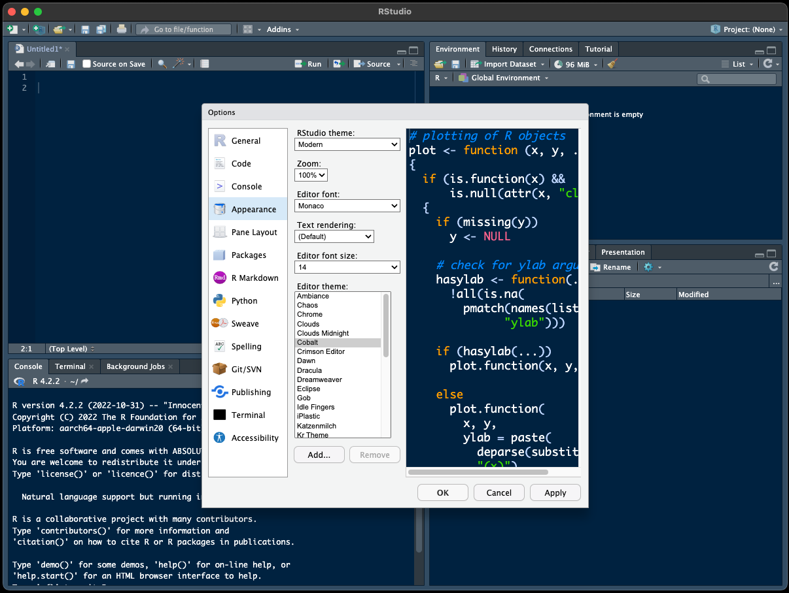

--- 
title: "Media Analytics With R"
author: "Jenny Jiang & Brian Walsh"
date: "`r Sys.Date()`"
site: bookdown::bookdown_site
---

# Preface {-}

The rapid development of information technology, along with the emergence of big data in the field of digital media, projects a workforce shortage for data-driven positions. In particular, the ability to use statistics to analyze and interpret the data obtained from tracking user interactions on websites and social media platforms make Communications students stand out in competitive job markets from a variety of industries.

However, the integration of analytics into universities’ communication programs and curricula (e.g., Journalism, Television and Cinema, Public Relations, Strategic Communications, Communication Design, Health Communication, Sports Communication, Environmental Communication) is yet to catch up to the industry’s new demands. 

To address this need, this book introduces Communication students to R, which is a free software environment for statistical computing and graphics, to measure and analyze audiences’ digital footprints, employ data-driven problem solving to gauge audience engagement, formulate insights, plan and execute strategies, and evaluate outcomes.

## Who is this book for?

Anyone who wants to learn basic data methodology and how to use the R programming language. Specifically, this book relies on analyzing text and social media and focuses on creating effective visualizations and avoiding methodological errors. R is a statistical programming language, but we'll be using it in a way that doesn't require that you have an extensive statistical background.

## Why R?

First of all, R is free, open-source, and runs on any OS. It is used by many professional journalistic and scientific organizations (The Guardian, the New York Times, etc.) for statistical analysis and data visualization.

R is a package-based language, meaning it downloads only the core functions and requires users to customize it to their needs. It therefore takes up a smaller amount of disc space and is highly customizeable.

A common issue with package-based languages is that the packages are all designed separately, and there are frequent compatibility issues. A solution to this problem in R, known as the tidyverse, combines a number of packages that are designed to work seamlessly with each other to deal with data manipulation, time adjustment, working with strings, importing data, and more.

R is a language, and its IDE, R Studio -- the software we run R 'inside' of -- adds a number of capabilities that make working in R easier, including the capability of publishing your R analysis directly to the web, as well as PDF, EPUB and .docx formats, and integrates with GitHub for version control.

R Studio is capable of also working and publishing using multiple programming languages (Python, Julia, Observable), as well as text, images and interactive visualizations, so you can easily publish and share a completed data analysis project effortlessly. In fact, this entire textbook was written and published using R and R Studio (repo available here).

## What will we learn to do with R in this book?

We'll start by learning the syntax of the tidyverse, which will then be used throughout the book. Using some example data sets, the book starts with data visualization so we can immediately see results from our programming.

After learning the basics of formatting and visualizing data, we'll focus on analyzing bodies of text, from great literature to social media. We'll learn how to perform a network analysis to discover online connections between social accounts. We'll also learn to make maps overlaid with data and how to avoid common methodological pitfalls.

## Installing the Software

R and R Studio must be installed separately on your computer. Start with R, by going to <https://cran.rstudio.com/> and choosing a version based on the Operating System you are using. Clicking on the Mac installation brings you to a page to choose which version to download; just download the latest one for your OS (note that there are separate versions for newer and older Macs). The downloaded file is a .pkg file, which you can double-click to install R into the default location on your Mac. On a PC, the link leads you to download the base, which is what you want when first installing R.

Then download R Studio from <https://posit.co/downloads/>. I recommend the 'free' version.

Once everything is installed, launching R Studio should automatically load R, and you're ready to go.

## Getting Started

Launching R Studio should lead you to a screen like this one:

I'm getting a pop-up that is asking me to install *git*, which will allow R Studio to run *version control*. This is all above our paygrade right now, but I can tell you that this pop-up won't go away completely until you succumb to its demands and install the git tools.

The R Studio interface is divided into 4 quadrants, but only 3 are visible at first: you have to click on the little 'mimimize/maximize' button to open the 'Source' tab in the upper-right. This is where we will write all of our R code, which we will then 'send down' to the console below it - the idea is that by writing the code in the 'Source' window, we can re-run it if we need to change anything.

R Studio should look like this now:

I personally feel that a) no one should write computer code on a white screen with black text and b) no one should write code, especially in a language that is new to them, in a 10-point font that's hard to read. Let's change those things by going to 'Tools' \> 'Global Options,' and adjusting the 'Appearance' of R Studio by changing the theme and the font size:

Once complete, we'll want to get used to writing our R code in the upper-left 'Source' tab. Here's an example: I've typed '4 + 12' into the 'Source' tab; now I'll click the 'Run' button to execute the code and see the results in the console. The very useful shortcut for 'Run' is 'Command-Enter' (Mac) or Control-Enter (PC). Try it!

## R Studio Projects

One of the most common issues new R users run into is 'finding' all of their materials on their computer's hard drive: their R scripts, their data files, and anything else needed to put together a report and, potentially, publish it.

The easiest way to avoid this common pitfall is to create a *project* for each new task you're doing in R. Creating a project requires that you specify a project *folder*, and then all you have to do is put your project's assets in there.

I'd recommend you create a new project for each of the hands-on coding chapters in this book. Not only will it be easier to load your data files, it'll also make it much easier to publish successfully.

OK, we're now ready to get introduced to the *tidyverse* and make our first visualizations.

